# 🔍 PAN Verification System — Interview & Portfolio Documentation


> ⚠️ **Scope note (read first):** This document describes exactly what exists in the uploaded repository — a **Spring Boot backend only** (`PanVerification-master`). The project's own `README.md` includes screenshots of a web UI (login, dashboard, admin panel, light/dark theme) and a CORS config that allows `http://localhost:5173` (Vite) and `http://localhost:3000`. That tells us a **separate frontend application exists**, but its source code is **not part of this repository**, so it is not documented here beyond what can be inferred from the backend and the 20 screenshots shipped in `docs/screenshots/`. Anywhere this document isn't 100% sure about something, it says so explicitly instead of guessing.

---

## 📚 Table of Contents

1. [Project Introduction](#-project-introduction)
2. [🚀 Live Demo](#-🚀 Live Demo)
3. [Screenshots](#-screenshots)
4. [Project Overview](#-project-overview)
5. [Resume Summary](#-resume-summary)
6. [Features](#-features)
7. [Technology Stack](#-technology-stack)
8. [Project Folder Structure](#-project-folder-structure)
9. [Complete Application Flow](#-complete-application-flow)
10. [Architecture](#-architecture)
11. [Database](#-database)
12. [API Documentation](#-api-documentation)
13. [Authentication Flow](#-authentication-flow)
14. [Class-by-Class Explanation](#-class-by-class-explanation)
15. [Code Walkthrough](#-code-walkthrough)
16. [Business Logic Explanation](#-business-logic-explanation)
17. [End-to-End Request Flow (One API, Fully Traced)](#-end-to-end-request-flow-one-api-fully-traced)
18. [SQL & JPA Queries](#-sql--jpa-queries)
19. [Exception Handling](#-exception-handling)
20. [Logging](#-logging)
21. [Security](#-security)
22. [Validation](#-validation)
23. [Docker](#-docker)
24. [Deployment](#-deployment)
25. [Testing](#-testing)
26. [Performance](#-performance)
27. [Known Issues / Challenges Faced](#-known-issues--challenges-faced)
28. [Improvements (Future Work)](#-improvements-future-work)
29. [50 Interview Questions From This Exact Project](#-50-interview-questions-from-this-exact-project)
30. [Recruiter Highlights](#-recruiter-highlights)
31. [ATS Keywords](#-ats-keywords)
32. [Developer Notes (Revisit-After-1-Year Notes)](#-developer-notes-revisit-after-1-year-notes)
33. [Revision Sheets](#-revision-sheets)
34. [Project Story — "Explain Your Project" Interview Answer](#-project-story--explain-your-project-interview-answer)

---

## 🚀 Project Introduction

**PAN Verification System** is a production-style **Spring Boot 4.1 / Java 21 REST API** that verifies Indian **PAN (Permanent Account Number)** cards in real time by integrating with the **Protean eGov Technologies (formerly NSDL) Online PAN Verification (OPV) API** — the official government-recognized service used by financial institutions, KYC vendors, and fintech companies to confirm that a PAN is genuine and matches the holder's name, father's name, and date of birth.

It was built to solve a very real business problem: **any Indian business that onboards customers — banks, NBFCs, stock brokers, insurance companies, payroll/HR systems, loan platforms — is legally required to verify a customer's PAN before opening an account or processing a KYC request.** Doing this by hand (or trusting user-entered data blindly) is slow, error-prone, and non-compliant. This project automates that entire verification pipeline: it accepts a PAN + personal details, digitally signs the request the way Protean requires (PKCS7/CMS signature using a registered Digital Signature Certificate), calls the government API, stores the full response for audit purposes, and exposes the result — plus history, admin analytics, and downloadable PDF/Excel reports — through secured REST endpoints.

The primary users are: **registered application users** (who submit PAN verification requests and view their own history/reports) and **administrators** (who see all users' data, platform-wide statistics, and reports). 💡 *In an interview, frame this project as "a compliance-automation microservice for KYC-style PAN verification with JWT security, external government API integration, and reporting" — that one sentence covers architecture, purpose, and complexity in one breath.*

---

## 🚀 Live Demo

No hosted/live demo (no deployed URL, no Swagger UI, no hosted frontend) — this is a backend-only Spring Boot service intended to be run locally (see [Installation Guide](#-installation-guide)).

### ▶️ Demo Video

[](https://drive.google.com/file/d/1wco99PDiV8PsaYbeLzUvdLhvYmlsACeL/view?usp=drive_link)

A walkthrough video demonstrating the Razorpay checkout flow, signature verification, and Kafka-driven enrollment email is available on Google Drive: **[Watch Demo](https://drive.google.com/file/d/1wco99PDiV8PsaYbeLzUvdLhvYmlsACeL/view?usp=drive_link)**

> GitHub doesn't render Google Drive video previews inline, so the badge above links out to the file. Make sure Drive sharing is set to **"Anyone with the link can view"** so recruiters aren't blocked by a permission request.

## 📸 Screenshots

⚠️ These 20 screenshots ship inside the repository at `docs/screenshots/` and are the **only** evidence of the separate frontend application mentioned above — its source code is not part of this repo, so the screenshots (not the backend code) are the source of truth for everything described in this section. They're reproduced here so the documentation is self-contained.

### Public / marketing pages

### Landing Page — Hero
Real-time PAN verification pitch with a live preview of a successful verification.

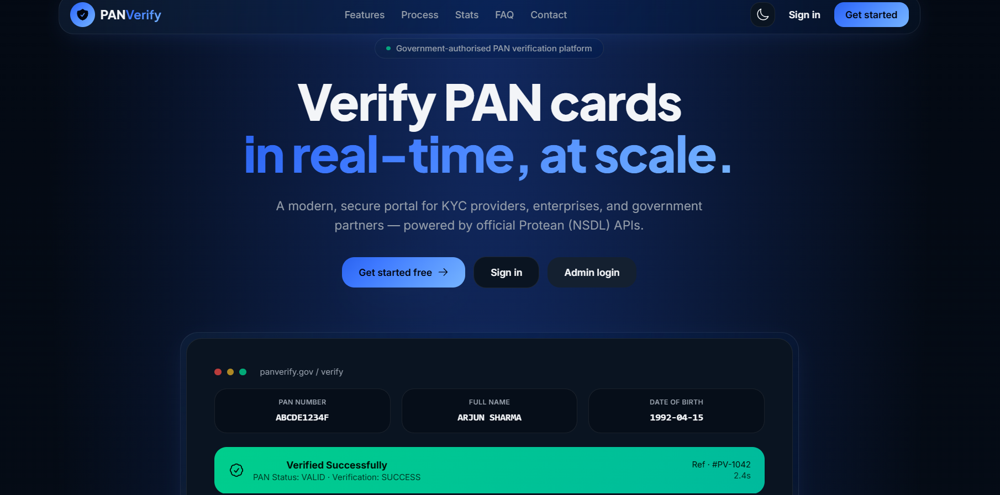

### Features
Everything the platform offers — real-time verification, JWT security, admin analytics, exportable reports, audit trail, and role-based access.

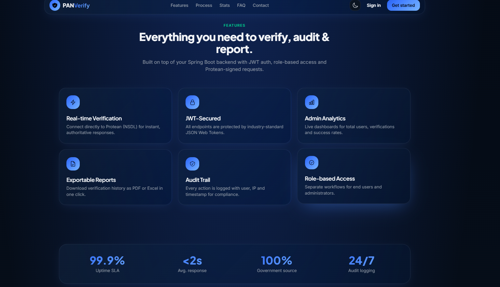

### Process & Benefits
A four-step walkthrough of how a PAN gets verified, plus the compliance and integration benefits.

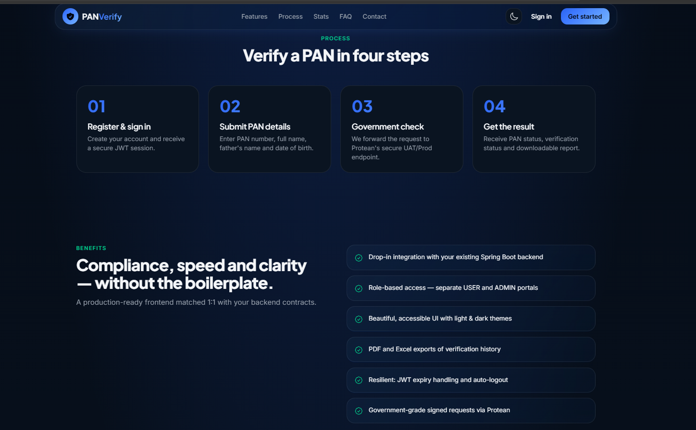

### FAQ & Call to Action
Common questions answered, with a call to action to create an account and start verifying.

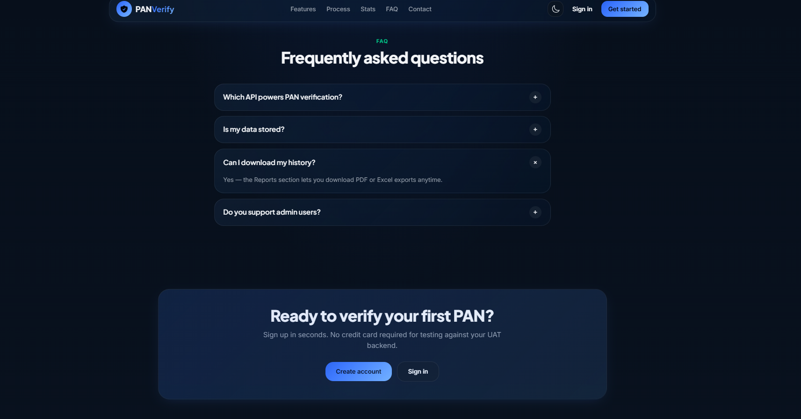

### Footer
Product links and contact details.


### Register
New user sign-up form — full name, email, username, and password.

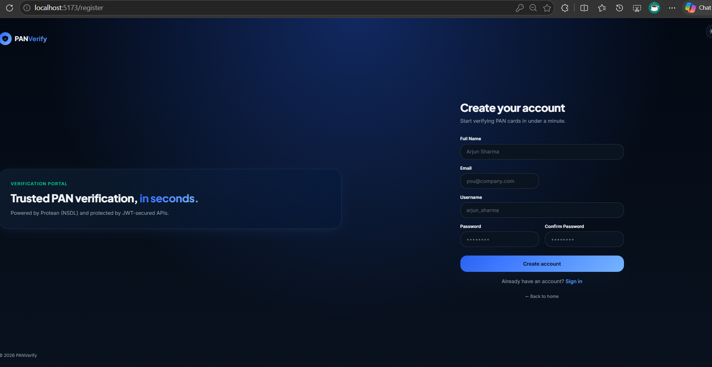

### Login
Sign-in form with remember-me, forgot password, and a separate admin login path.

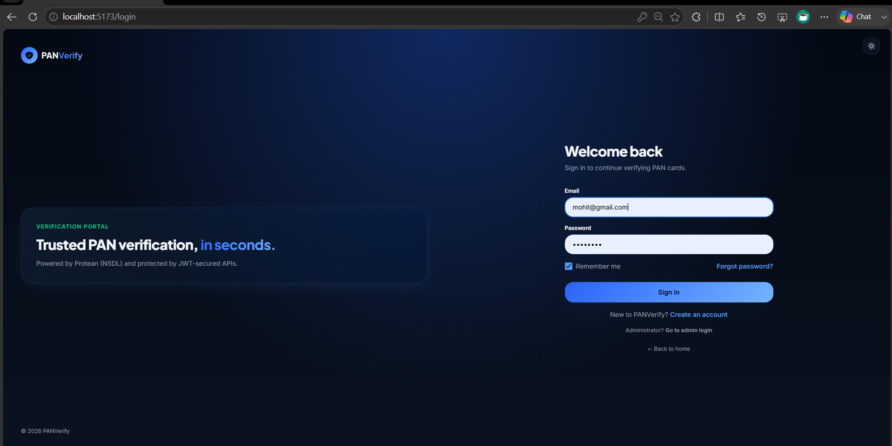

### User Dashboard
Verification stats at a glance, recent verifications table, and a quick-verify shortcut.

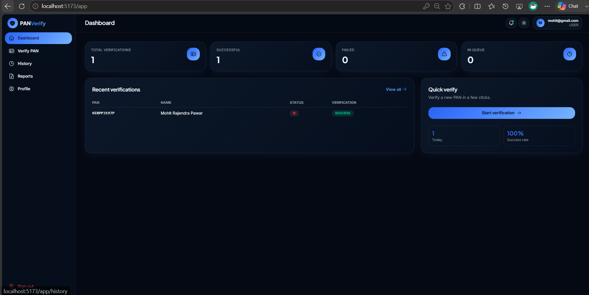

### Verify PAN
The verification form (PAN number, name, father's name, DOB) with a live success result panel.

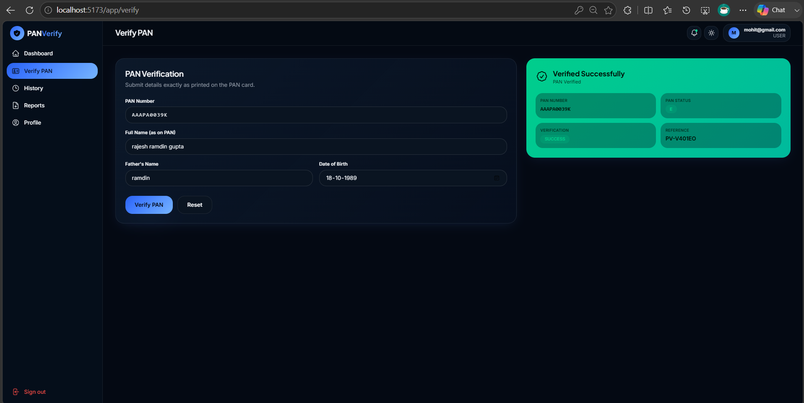

### Verification History
Searchable table of past verifications with CSV/PDF export and refresh.

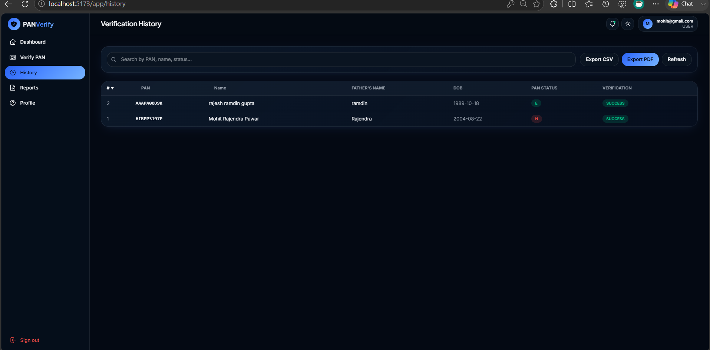

### Reports
One-click download of the full verification history as a PDF or Excel report.

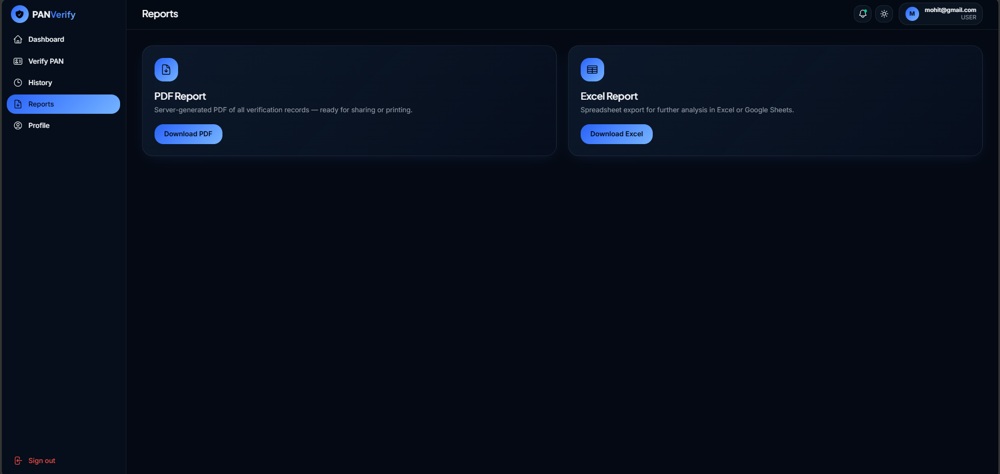

### PDF Report
Generated PAN Verification Report showing total/valid/invalid/pending counts and a per-record table (PAN number, status, verified-at timestamp).

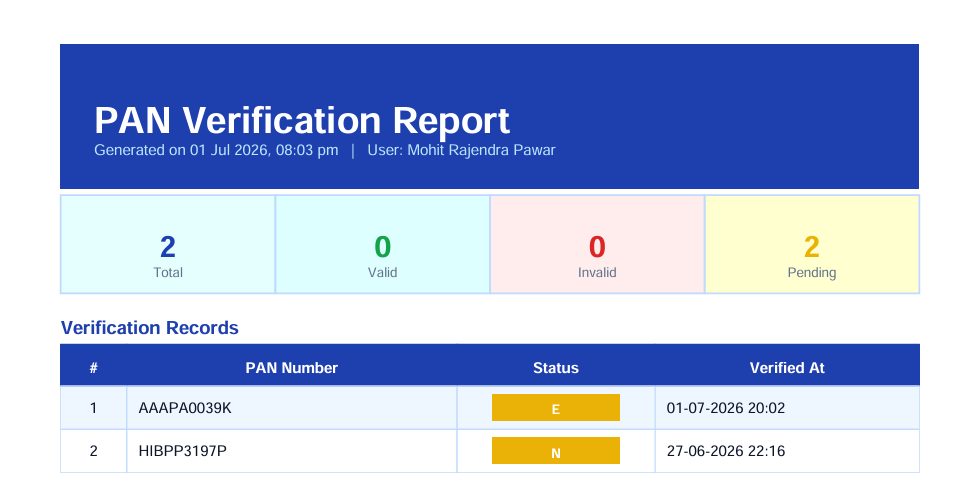

### Excel Report
The same verification data exported as a filterable `.xlsx` workbook with summary counts and a sortable records table.

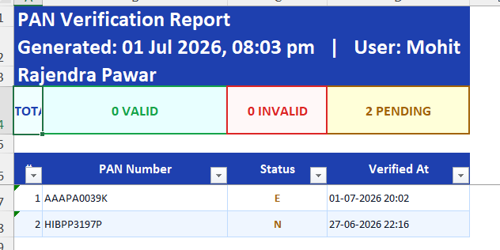

### Profile
View-only account profile — email, role, avatar, and a change-password form.

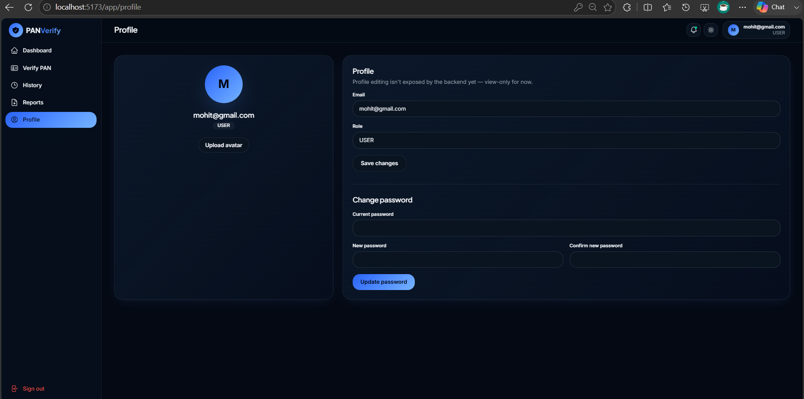

### Admin Login
Separate restricted sign-in for administrators, with audit-logged sessions.

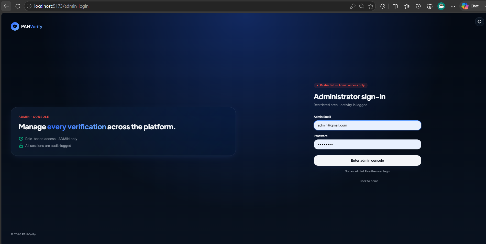

### Admin Dashboard
Admin overview with total users, total verifications, success rate, failed requests, PAN-series/volume/success-failure charts, and recent activity.

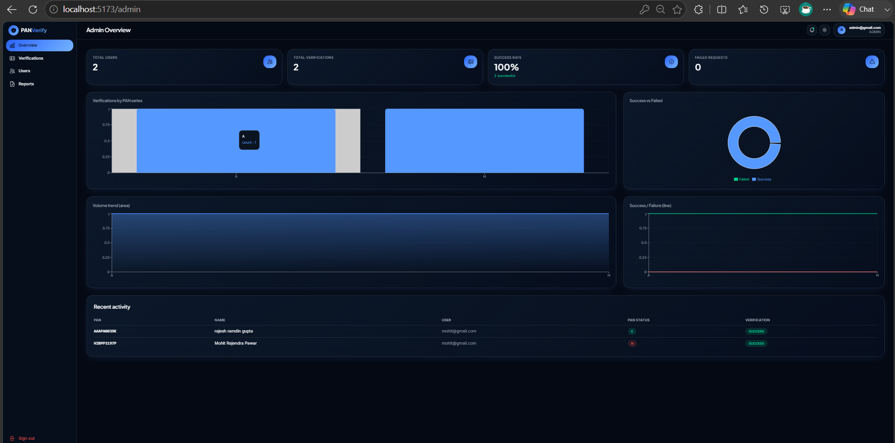

### Admin — All Verifications
Full cross-user verification list with search by PAN, showing name, father's name, DOB, submitting user, PAN status, and result.

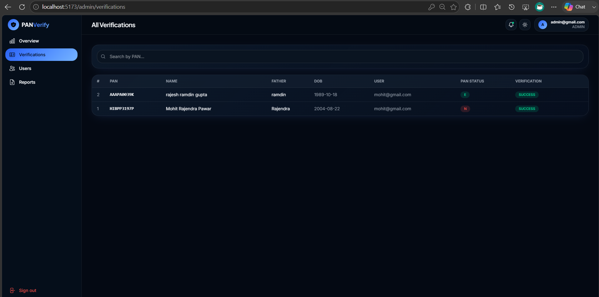

### Admin — Users
Registered user count with a table of active users derived from verification activity (username, full name, email, verification count).

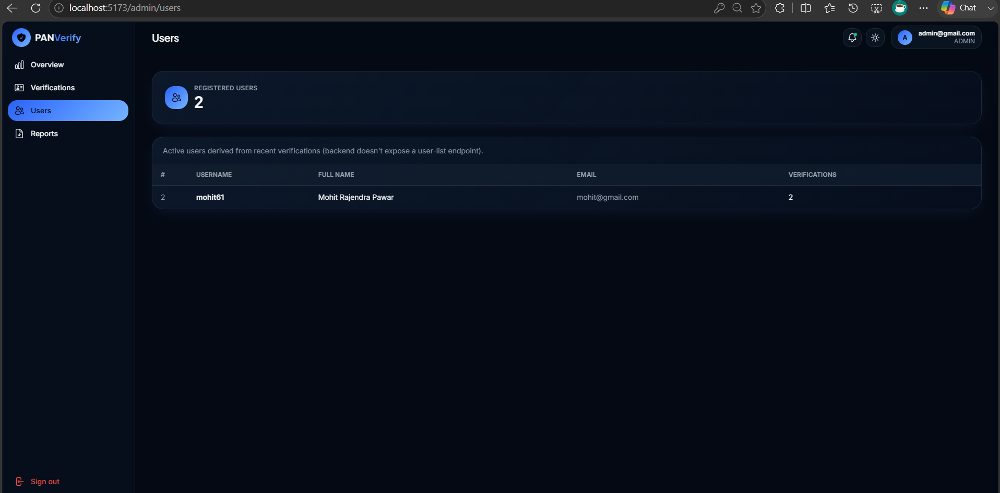

### Admin — Reports
Admin-side download hub for the PDF and Excel verification reports.

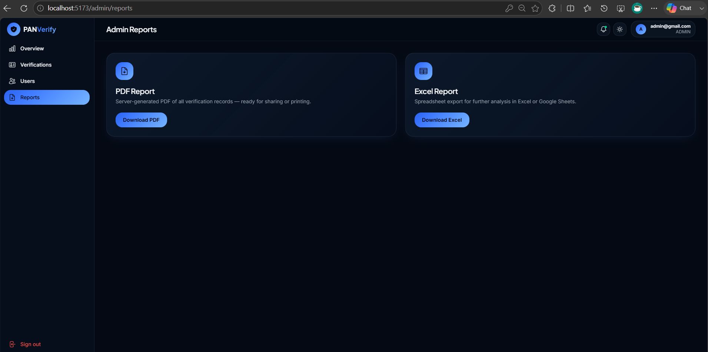

### Light Theme
The application also supports a light theme, toggled from the top bar.

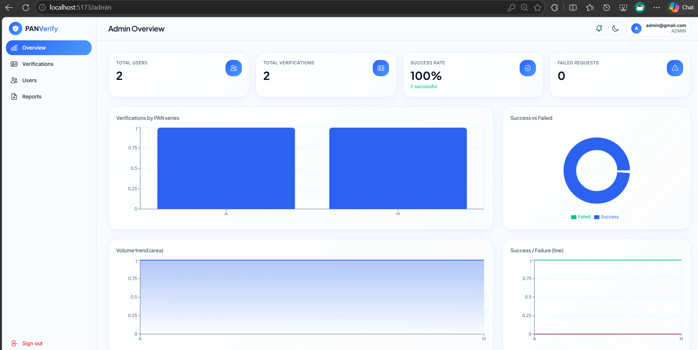

💡 **Interview angle:** if asked "does this project have a UI?", the honest, precise answer is: *"The repository I'm walking you through is the backend REST API only. There's a companion frontend — you can tell from the CORS config allowing a Vite dev server and from the 20 screenshots the repo ships — but its source isn't in this repository, so I can speak to what the screenshots show, not to its implementation."* That's a stronger answer than pretending you built (or didn't build) something you can't actually show code for.

---

## 📖 Project Overview

**Why this project exists:** Manual PAN verification means someone in a back office typing PAN numbers into a government portal one at a time and copy-pasting results — slow, unauditable, and impossible to scale. This system turns that into a single authenticated REST call.

**How users use it (based on the backend's exposed capabilities):**
1. A user registers (`/api/users/register`) and logs in (`/api/users/login`) to receive a JWT.
2. The user submits a PAN verification request (`/api/pan/verify`) with the PAN number, full name, father's name, and date of birth.
3. The backend signs the payload, calls Protean's OPV API, stores the result, and returns whether the PAN is `VALID`/`INVALID` along with a human-readable status message.
4. The user can view their own verification **history** (`/api/pan/history`), **search** past verifications by PAN (`/api/pan/search`), and **export** their records as a **PDF** or **Excel** report (`/api/report/pdf`, `/api/report/excel`).
5. An **admin** can view platform-wide **dashboard stats** (`/api/admin/dashboard`, `/api/admin/stats`) — total users and total verifications — and (based on role checks in `PanVerificationService`) sees **all** users' records in history, search, and reports rather than only their own.

**Main business flow:** `Register/Login → Authenticate with JWT → Submit PAN details → Sign request → Call Protean → Parse & persist response → Return verification result → (optionally) Export report`.

**Major modules (Java packages):**

| Package | Responsibility |
|---|---|
| `controller` | REST endpoints — the entry point for every HTTP request |
| `service` | Business logic — orchestrates verification, signing, reporting, user management |
| `security` | JWT generation/validation and Spring Security wiring |
| `repository` | Spring Data JPA interfaces — database access |
| `entity` | JPA entities mapped to MySQL tables |
| `dto` | Request/response data carriers (mostly Java `record`s) |
| `exception` | Custom exceptions + a global exception handler |
| `util` | PDF (iText) and Excel (Apache POI) report generators, constants |
| `config` | Spring `@Configuration` beans — CORS, Swagger, RestTemplate, password encoder, default admin bootstrap |

---

## 📝 Resume Summary

> Designed and developed a **production-style Spring Boot 4.1 (Java 21) REST API** for real-time **PAN card verification**, integrating with the **Protean (NSDL) Government OPV API** using **PKCS7/CMS digital signatures** (BouncyCastle) signed with a **JKS Digital Signature Certificate**. Implemented **JWT-based stateless authentication** with **role-based access control** (`USER`/`ADMIN`) via **Spring Security**, a **JPA/Hibernate + MySQL** persistence layer across 5 relational tables, and **dynamically generated PDF (iText) and Excel (Apache POI) reports**. Documented all endpoints with **Swagger/OpenAPI**, added structured **rolling-file logging** with **Logback**, and built a **global exception-handling layer** with custom domain exceptions.

💡 One-liner for a resume bullet: *"Built a secure Spring Boot REST API integrating a government PAN-verification service with JWT auth, role-based access, PKCS7 digital signatures, and exportable PDF/Excel reports."*

---

## ✨ Features

| # | Feature | What it does | Why it exists | Implementing class(es) | API | DB table(s) |
|---|---|---|---|---|---|---|
| 1 | **User Registration** | Creates a new `USER` account with a BCrypt-hashed password | Self-service onboarding | `UserController` → `UserService` | `POST /api/users/register` | `users` |
| 2 | **Login + JWT Issuance** | Verifies credentials, returns a signed JWT + role | Stateless authentication for all subsequent calls | `UserController` → `UserService` → `JwtService` | `POST /api/users/login` | `users` |
| 3 | **Default Admin Bootstrap** | Auto-creates `admin@gmail.com` / `admin123` with role `ADMIN` on first startup if it doesn't already exist | Guarantees the system is usable out-of-the-box without manual SQL | `AdminInitializer` (`CommandLineRunner`) | — (runs at boot) | `users` |
| 4 | **PAN Verification** | Signs the request, calls Protean OPV, parses/persists the response, returns a verdict | The core business capability | `PanVerificationController` → `PanVerificationService` → `ProteanService` → `SignatureService` | `POST /api/pan/verify` | `pan_verification`, `protean_response_header`, `protean_output_data` |
| 5 | **Digital Signature Generation (PKCS7/CMS)** | Signs the outgoing JSON payload with SHA1withRSA using a private key from a JKS keystore | Protean's OPV API mandates a digitally signed request for legal non-repudiation | `SignatureService` (BouncyCastle `CMSSignedDataGenerator`) | supporting `/api/pan/generate-signature`, `/api/pan/test-sign` | — |
| 6 | **Protean OPV Integration** | Builds the OPV request headers/body and calls the government endpoint over HTTPS (with a relaxed SSL trust manager for UAT) | This *is* the external system being integrated with | `ProteanService`, `RestTemplateConfig` | `POST /api/protean/proteanverify` (also called internally by verification flow) | — |
| 7 | **Verification History** | Lists a user's (or, for admins, everyone's) past verifications, most-recent first | Auditability / self-service record lookup | `PanVerificationController` → `PanVerificationService` | `GET /api/pan/history` | `pan_verification` |
| 8 | **PAN Search** | Filters verification records by a PAN substring | Quick lookup without scrolling full history | `PanVerificationController` → `PanVerificationService` | `GET /api/pan/search?pan=` | `pan_verification` |
| 9 | **Admin Dashboard Stats** | Returns total user count and total verification count | Gives admins a system health snapshot | `AdminController` → `DashboardService` | `GET /api/admin/dashboard`, `GET /api/admin/stats` | `users`, `pan_verification` |
| 10 | **PDF Report Export** | Generates a styled, branded PDF of verification records (role-aware columns) | Compliance teams need offline/printable records | `ReportController` → `PanVerificationService` → `PdfGenerator` (iText) | `GET /api/report/pdf` | `pan_verification` |
| 11 | **Excel Report Export** | Generates a styled, multi-sheet `.xlsx` workbook with a summary sheet | Same as above, in a format finance teams prefer | `ReportController` → `PanVerificationService` → `ExcelGenerator` (Apache POI) | `GET /api/report/excel` | `pan_verification` |
| 12 | **Role-Based Access Control** | Restricts `/api/admin/**` to `ROLE_ADMIN`, requires authentication elsewhere | Least-privilege security | `SecurityConfig`, `JwtAuthFilter` | (applies to all routes) | `users` |
| 13 | **Swagger/OpenAPI Docs** | Interactive API explorer with a JWT bearer-auth button | Lets any developer/tester try the API without Postman | `SwaggerConfig` | `/swagger-ui.html`, `/v3/api-docs` | — |
| 14 | **Structured Logging** | Console + daily-rotating file logs, DEBUG for app code, INFO for Spring Security/root | Debuggability and audit trail | `logback-spring.xml` | — | — |
| 15 | **Global Exception Handling** | Centralizes error responses for known failure cases | Consistent, predictable API error contracts | `GlobalExceptionHandler` | (cross-cutting) | — |

⚠️ Two more pieces exist in the code (`AuditLog` entity/repository/service and `CertificateService`) but are **not wired into any controller path** — see [Known Issues](#-known-issues--challenges-faced) and the [Class-by-Class](#-class-by-class-explanation) section for details. Documenting *only what actually runs* is deliberate — a recruiter or interviewer who opens the repo should not find surprises.

---

## 🧰 Technology Stack

| Technology | Purpose in this project | Why it was likely chosen | Common alternative |
|---|---|---|---|
| **Java 21** | Language runtime | LTS release, modern language features (records used extensively for DTOs, pattern-matching `switch` used in `getResponseMessage`) | Java 17 (previous LTS) |
| **Spring Boot 4.1.0** | Application framework — auto-configuration, embedded Tomcat, dependency injection | Industry standard for Java REST backends; drastically reduces boilerplate | Micronaut, Quarkus |
| **Spring MVC** (`spring-boot-starter-web`) | Building REST controllers (`@RestController`) | De facto standard for Spring REST APIs | JAX-RS (Jersey) |
| **Spring Security** | Authentication/authorization, filter chain, password encoding | Mature, deeply integrated with Spring, supports custom filters like the project's `JwtAuthFilter` | Apache Shiro |
| **JWT — `io.jsonwebtoken:jjwt` 0.12.5** | Stateless auth tokens (`JwtService`) | Avoids server-side session storage; scales horizontally | Spring Session + Redis-backed sessions |
| **Spring Data JPA + Hibernate** | ORM — entities to MySQL tables via repository interfaces | Removes hand-written SQL/JDBC boilerplate for standard CRUD | MyBatis, plain JDBC |
| **MySQL 8** | Relational database (`pan_verification_db`) | Free, widely deployed, good fit for structured, relational KYC data | PostgreSQL |
| **BouncyCastle** (`bcprov-jdk18on`, `bcpkix-jdk18on`) | Generates the PKCS7/CMS digital signature Protean requires | The JDK's built-in crypto providers don't support CMS/PKCS7 signing out of the box; BouncyCastle is the standard Java crypto library for this | — (few real alternatives for CMS signing in Java) |
| **Apache HttpClient5** (`httpclient5`) | Backs the `RestTemplate` used to call Protean, with a custom SSL context | Needed to bypass certificate validation against Protean's UAT (test) endpoint | `WebClient` (reactive) |
| **iTextPDF 5.5.13.3** | Generates the PDF verification report | Mature, fine-grained control over tables/colors/fonts for a "branded" report | Apache PDFBox |
| **Apache POI 5.4.1 (poi-ooxml)** | Generates the `.xlsx` Excel report with styled cells, merged banners, auto-filter | The standard Java library for reading/writing Office file formats | FastExcel |
| **Jackson** | JSON (de)serialization, used explicitly via `ObjectMapper` to parse Protean's raw JSON response | Spring Boot's default JSON library | Gson |
| **Gson 2.10.1** | Present as a dependency | Declared in `pom.xml`; not directly referenced in the reviewed source — likely available for ad-hoc JSON handling | — |
| **SpringDoc OpenAPI 2.8.9** | Generates Swagger UI + OpenAPI spec, with a bearer-token security scheme | Auto-generates docs from annotated controllers | Manual Postman collection |
| **Lombok** | Removes boilerplate getters/setters/constructors (`@Data`, `@Builder`, `@Slf4j`, `@RequiredArgsConstructor`) | Keeps entity/service code concise | Manual boilerplate, or Java `record`s (used for DTOs already) |
| **Maven** | Build tool / dependency management | Project ships with the Maven wrapper (`mvnw`) | Gradle |
| **Spring Boot DevTools** | Auto-restart on code change during development | Faster local dev loop | — |
| **JUnit 5 + Spring Boot Test starters** | Declared as test dependencies (`spring-boot-starter-*-test`) | Standard Spring testing stack | — |
| **Git / GitHub** | Source control and hosting for the repository this document describes | Industry-standard version control; enables the exact class-by-class, commit-visible review this document is built from | GitLab, Bitbucket |

⚠️ **Not present in this repository**, even though a general full-stack Java project brief might expect them — documented honestly rather than invented: **Redis** (no caching layer — `DashboardService` recomputes counts on every call), **Kafka** (no messaging/eventing — every step of `verify()` runs synchronously in-request), **Docker** (no `Dockerfile`/`docker-compose.yml` — see [Docker](#-docker)), **Mockito** (declared as a transitive test dependency but no test doubles are actually written — see [Testing](#-testing)), and **PostgreSQL** (MySQL is used instead).

---

## 🗂 Project Folder Structure

```
PanVerification-master/
├── mvnw, mvnw.cmd              # Maven wrapper scripts (build without a local Maven install)
├── pom.xml                     # Maven build file — all dependencies & plugins
├── .gitattributes / .gitignore
├── README.md                   # The project's own original README (screenshots, setup steps)
├── docs/
│   └── screenshots/            # 20 PNG screenshots of a web frontend (frontend code not in this repo)
├── logs/                       # Rolling log files written at runtime by Logback
│   ├── pan-verification.log
│   └── pan-verification.<date>.log
├── src/
│   ├── main/
│   │   ├── java/com/verify/panverification/
│   │   │   ├── PanVerificationApplication.java     # @SpringBootApplication entry point
│   │   │   ├── config/          # Cross-cutting Spring @Configuration beans
│   │   │   │   ├── AdminInitializer.java     # CommandLineRunner — seeds default admin
│   │   │   │   ├── AppConfig.java            # BCryptPasswordEncoder, ObjectMapper beans
│   │   │   │   ├── CorsConfig.java           # Allows localhost:5173 / :3000 (the frontend)
│   │   │   │   ├── RestTemplateConfig.java   # RestTemplate with relaxed SSL trust (UAT)
│   │   │   │   └── SwaggerConfig.java        # OpenAPI bean w/ Bearer JWT scheme
│   │   │   ├── controller/      # REST endpoints (HTTP layer only — no business logic)
│   │   │   │   ├── AdminController.java
│   │   │   │   ├── PanVerificationController.java
│   │   │   │   ├── ProteanController.java
│   │   │   │   ├── ReportController.java
│   │   │   │   └── UserController.java
│   │   │   ├── dto/             # Request/response records
│   │   │   │   ├── ApiResponse.java, DashboardResponse.java, InputDataDto.java,
│   │   │   │   ├── LoginRequest.java, LoginResponse.java, OpvRequest.java,
│   │   │   │   ├── PanRequest.java, PanVerificationRequest.java, PanVerificationResponse.java,
│   │   │   │   └── RegisterRequest.java, RequestBody.java
│   │   │   ├── entity/          # JPA entities (map 1:1 to MySQL tables)
│   │   │   │   ├── AuditLog.java, PanVerification.java, ProteanOutputData.java,
│   │   │   │   └── ProteanResponseHeader.java, Role.java (enum), User.java
│   │   │   ├── exception/       # Custom exceptions + global handler
│   │   │   │   ├── GlobalExceptionHandler.java, InvalidPanException.java,
│   │   │   │   └── ResourceNotFoundException.java, UserAlreadyExistsException.java
│   │   │   ├── repository/      # Spring Data JPA interfaces
│   │   │   │   ├── AuditLogRepository.java, PanVerificationRepository.java,
│   │   │   │   └── ProteanOutputDataRepository.java, ProteanResponseHeaderRepository.java, UserRepository.java
│   │   │   ├── security/        # JWT + Spring Security wiring
│   │   │   │   ├── CustomUserDetailsService.java, JwtAuthFilter.java,
│   │   │   │   └── JwtService.java, SecurityConfig.java
│   │   │   ├── service/         # Business logic
│   │   │   │   ├── AuditService.java, CertificateService.java, DashboardService.java,
│   │   │   │   ├── PanVerificationService.java, ProteanService.java, ReportService.java,
│   │   │   │   └── SignatureService.java, UserService.java
│   │   │   └── util/            # Report generators + constants
│   │   │       ├── Constants.java, ExcelGenerator.java, PdfGenerator.java
│   │   └── resources/
│   │       ├── application.properties     # DB, JWT secret, Protean config, logging
│   │       ├── logback-spring.xml         # Console + rolling-file log config
│   │       └── certs/
│   │           ├── output.jks             # JKS keystore holding the signing private key
│   │           └── VerasysSubCA2022.pfx   # A PFX certificate (CA-related)
│   └── test/
│       └── java/com/verify/panverification/
│           └── PanVerificationApplicationTests.java   # Only test: Spring context loads
```

**How the layers interact:** `controller` depends on `service`; `service` depends on `repository` (data), other `service`s (collaboration, e.g. `PanVerificationService` → `ProteanService` → `SignatureService`), and `util` classes (report generation). `security` sits in front of `controller` as a servlet filter. `dto` and `entity` are the data shapes passed between layers — DTOs never leak entity internals directly to the client in the verification flow (the response is a purpose-built `PanVerificationResponse`), though a few endpoints (`/api/pan/history`, `/api/pan/search`) do return the `PanVerification` **entity** directly rather than a DTO. ⚠️ *That's worth knowing for an interview — returning entities directly from a controller is a common code-review flag because it risks exposing internal fields (e.g., the linked `User`) and tightly couples the API contract to the database schema.*

---

## 🔄 Complete Application Flow

**From `mvn spring-boot:run` (or the JAR) to serving a request:**

```
1. JVM starts → SpringApplication.run(PanVerificationApplication.class, args)
        │
2. Spring Boot auto-configuration scans @SpringBootApplication package
        │
3. Beans are created in dependency order:
        - AppConfig → BCryptPasswordEncoder, ObjectMapper
        - RestTemplateConfig → RestTemplate (SSL-relaxed, for Protean UAT)
        - CorsConfig → WebMvcConfigurer (allows the frontend's origin)
        - SwaggerConfig → OpenAPI bean
        - Repositories (Spring Data JPA proxies) are generated for every *Repository interface
        - Services (@Service) are instantiated, repositories injected via constructor (Lombok @RequiredArgsConstructor)
        - Controllers (@RestController) are instantiated, services injected
        - Security beans: CustomUserDetailsService, JwtService, JwtAuthFilter, SecurityConfig.securityFilterChain()
        │
4. Hibernate connects to MySQL using spring.datasource.* properties
        - spring.jpa.hibernate.ddl-auto=update → Hibernate creates/updates tables to match entities
        │
5. AdminInitializer (CommandLineRunner) runs automatically after context startup
        - Checks if admin@gmail.com exists; if not, creates a default ADMIN user
        │
6. Embedded Tomcat starts and begins listening (default port 8080)
        │
7. ── A client sends an HTTP request ──
        │
8. Request passes through the Spring Security filter chain
        - JwtAuthFilter inspects the Authorization header
        - If a valid "Bearer <token>" is present → JWT is verified, a User principal is
          loaded and placed into the SecurityContext with a ROLE_* authority
        - If missing → request proceeds unauthenticated (public endpoints allow this;
          protected endpoints will be rejected downstream by authorizeHttpRequests rules)
        │
9. DispatcherServlet routes the request to the matching @RestController method
        │
10. Controller extracts the authenticated User (via Authentication/@AuthenticationPrincipal)
        and delegates to the Service layer
        │
11. Service layer executes business logic (e.g., sign + call Protean + persist)
        │
12. Repository layer (Spring Data JPA) issues SQL against MySQL
        │
13. Service builds a response DTO; Controller wraps it in an HTTP response (often ApiResponse)
        │
14. Response is serialized to JSON by Jackson and sent back to the client
        │
15. On JVM shutdown, Spring context closes; connection pool (HikariCP, Spring Boot's default) drains
```

💡 Interview framing: *"On startup, Spring wires the DI graph, Hibernate syncs the schema, and a CommandLineRunner seeds a default admin — so the API is usable immediately after `mvn spring-boot:run` with zero manual setup beyond a MySQL database and a signing certificate."*

---

## 🏛 Architecture

**Layered architecture (Controller → Service → Repository → Database):**

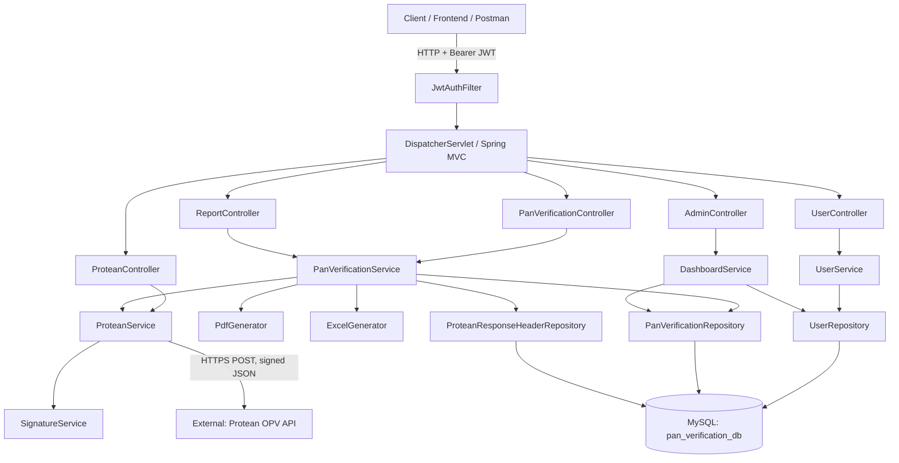
```mermaid
graph TD
    A[Client / Frontend / Postman] -->|HTTP + Bearer JWT| B[JwtAuthFilter]
    B --> C[DispatcherServlet / Spring MVC]
    C --> D1[UserController]
    C --> D2[PanVerificationController]
    C --> D3[ProteanController]
    C --> D4[AdminController]
    C --> D5[ReportController]

    D1 --> E1[UserService]
    D2 --> E2[PanVerificationService]
    D3 --> E3[ProteanService]
    D4 --> E4[DashboardService]
    D5 --> E2

    E2 --> E3
    E3 --> E5[SignatureService]
    E2 --> E6[PdfGenerator]
    E2 --> E7[ExcelGenerator]

    E1 --> F1[UserRepository]
    E2 --> F2[PanVerificationRepository]
    E2 --> F3[ProteanResponseHeaderRepository]
    E4 --> F1
    E4 --> F2

    F1 --> G[(MySQL: pan_verification_db)]
    F2 --> G
    F3 --> G

    E3 -->|HTTPS POST, signed JSON| H[External: Protean OPV API]
```

**External integration:** `ProteanService` calls the real government endpoint configured in `protean.uat-url` — this is the one place the system talks outside its own process/database boundary (besides the DB connection itself).

---

## 🗄 Database

The schema is generated by Hibernate from the JPA entities (`spring.jpa.hibernate.ddl-auto=update`) — there is no separate `schema.sql`/Flyway/Liquibase migration file in the repo, so **the entities are the single source of truth for the schema.**

### ER Diagram

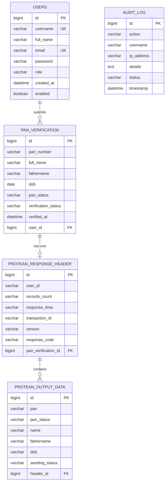
```mermaid
erDiagram
    USERS ||--o{ PAN_VERIFICATION : "submits"
    PAN_VERIFICATION ||--o| PROTEAN_RESPONSE_HEADER : "has one"
    PROTEAN_RESPONSE_HEADER ||--o{ PROTEAN_OUTPUT_DATA : "contains"

    USERS {
        bigint id PK
        varchar username UK
        varchar full_name
        varchar email UK
        varchar password
        varchar role
        datetime created_at
        boolean enabled
    }

    PAN_VERIFICATION {
        bigint id PK
        varchar pan_number
        varchar full_name
        varchar fathername
        date dob
        varchar pan_status
        varchar verification_status
        datetime verified_at
        bigint user_id FK
    }

    PROTEAN_RESPONSE_HEADER {
        bigint id PK
        varchar user_id
        varchar records_count
        varchar response_time
        varchar transaction_id
        varchar version
        varchar response_code
        bigint pan_verification_id FK
    }

    PROTEAN_OUTPUT_DATA {
        bigint id PK
        varchar pan
        varchar pan_status
        varchar name
        varchar fathername
        varchar dob
        varchar seeding_status
        bigint header_id FK
    }

    AUDIT_LOG {
        bigint id PK
        varchar action
        varchar username
        varchar ip_address
        text details
        varchar status
        datetime timestamp
    }
```

⚠️ `AUDIT_LOG` has **no foreign-key relationship** to any other table in the entity model (it's a flat log table), and — as noted throughout this doc — nothing currently writes to it at runtime.

### Table-by-table

**`users`** (`User.java`)
- **Purpose:** Stores every registered account; implements Spring Security's `UserDetails` directly on the entity (no separate "Principal" wrapper class).
- **Key columns:** `username`, `email` (both unique + not-null), `password` (BCrypt hash — never plaintext), `role` (`USER`/`ADMIN` enum, stored as `STRING` via `@Enumerated(EnumType.STRING)`), `enabled` (defaults `true`).
- **Primary key:** `id` (auto-increment / `IDENTITY`).
- **Relationships:** One user → many `PanVerification` records (`@ManyToOne` on the `PanVerification` side).
- **Inserted:** on `POST /api/users/register`, and once at startup by `AdminInitializer`.
- **Updated:** no update endpoint exists in the reviewed code.
- **Deleted:** no delete endpoint exists.

**`pan_verification`** (`PanVerification.java`)
- **Purpose:** One row per PAN verification attempt — the "case record."
- **Key columns:** `panNumber`, `fullName`, `fathername`, `dob`, `panStatus` (Protean's status code for the PAN, e.g. `E`/`X`/`D`...), `verificationStatus` (this app's own `SUCCESS`/`FAILED` outcome), `verifiedAt` (set in `@PrePersist`).
- **Primary key:** `id`.
- **Foreign key:** `user_id` → `users.id` (`@ManyToOne(fetch = FetchType.LAZY)`).
- **Inserted:** every call to `PanVerificationService.verify()`, regardless of whether Protean's call succeeded or failed — a row is always saved, with `verificationStatus = "FAILED"` on any failure path. This is a **deliberate audit-trail design**: every attempt is recorded, not just successful ones.
- **Updated:** never (no update path).
- **Deleted:** never (no delete path) — consistent with an audit/compliance use case.

**`protean_response_header`** (`ProteanResponseHeader.java`)
- **Purpose:** Stores the metadata Protean returns in its HTTP response headers (`User_ID`, `Records_count`, `Response_time`, `Transaction_ID`, `Version`) plus the parsed `response_Code` from the JSON body.
- **Relationships:** `@OneToOne` back to the `PanVerification` that triggered it; `@OneToMany` (cascade `ALL`) to its `ProteanOutputData` rows.
- **Inserted:** immediately after every `PanVerificationService.verify()` call.

**`protean_output_data`** (`ProteanOutputData.java`)
- **Purpose:** One row per PAN record Protean actually returned data for (Protean's API supports batch verification of multiple PANs per call, even though this app only ever sends one at a time).
- **Key columns:** `pan`, `panStatus`, `name`, `fathername`, `dob`, `seedingStatus` (Aadhaar-PAN linkage status).
- **Foreign key:** `header_id` → `protean_response_header.id`.
- **Inserted:** as part of the same save cascaded from `ProteanResponseHeader` when Protean's `response_Code == "1"` (success) and `outputData` is a non-empty array.

**`audit_log`** (`AuditLog.java`)
- **Purpose (as designed):** Generic action log — `action`, `username`, `ipAddress`, `details`, `status`, `timestamp`.
- ⚠️ **Currently dead:** `AuditService.saveLog(...)` is the only code that would insert into this table, and **no controller or service calls `AuditService`.** The table will exist (Hibernate creates it) but will always stay empty unless someone wires the call in.

---

## 📡 API Documentation

All endpoints are prefixed as shown. JWT must be sent as `Authorization: Bearer <token>` for anything not explicitly public.

### `POST /api/users/register` — Register a new user
| | |
|---|---|
| **Purpose** | Create a new `USER` account |
| **Auth required** | ❌ No (public, per `SecurityConfig`) |
| **Request body** | `RegisterRequest`: `{ "username": "...", "FullName": "...", "email": "...", "password": "...", "role": "..." }` |
| **Response** | `ApiResponse` → `{ "success": true, "message": "User Registered Successfully", "data": null }` |
| **Validation** | ⚠️ None declared on `RegisterRequest` (no `@Valid`/`@NotBlank` annotations) — the controller method also doesn't annotate the parameter with `@Valid`, so malformed/blank input is not rejected at this layer. |
| **Possible errors** | A duplicate `username`/`email` will violate the DB's unique constraint and surface as an unhandled `DataIntegrityViolationException` (500) — `UserAlreadyExistsException` exists in the `exception` package but **is never thrown** by `UserService.register()`. ⚠️ This is a real gap: the custom exception was clearly designed for this exact scenario but isn't used yet. |
| **Related service / repo** | `UserService.register()` → `UserRepository.save()` |
| **Note** | The incoming `role` field on `RegisterRequest` is **ignored** — `UserService` always hard-codes `Role.USER`, which is a sensible security choice (a client can't self-promote to admin through this endpoint). |

### `POST /api/users/login` — Authenticate and receive a JWT
| | |
|---|---|
| **Purpose** | Verify email + password, issue a JWT |
| **Auth required** | ❌ No |
| **Request body** | `LoginRequest`: `{ "email": "...", "password": "..." }` |
| **Response** | `ApiResponse<LoginResponse>` → `{ "success": true, "message": "Login Successful", "data": { "token": "...", "role": "USER" } }` |
| **Validation** | Manual — throws a generic `RuntimeException("User not found")` / `RuntimeException("Invalid Password")` if checks fail. |
| **Possible errors** | Since these are plain `RuntimeException`s (not caught by `GlobalExceptionHandler`, which only handles `ResourceNotFoundException`, `InvalidPanException`, `UserAlreadyExistsException`), Spring Boot's default error handler returns a generic `500 Internal Server Error` rather than a clean `401 Unauthorized`. ⚠️ Worth flagging as an improvement. |
| **Related service** | `UserService.login()` → `JwtService.generateToken()` |

### `POST /api/pan/verify` — Verify a PAN
| | |
|---|---|
| **Purpose** | Core feature — digitally sign, call Protean, persist, and return the verification result |
| **Auth required** | ✅ Yes |
| **Request body** | `PanVerificationRequest`: `{ "panNumber": "ABCDE1234F", "fullName": "...", "fathername": "...", "dob": "YYYY-MM-DD" }` |
| **Response** | `ApiResponse` wrapping a `PanVerificationResponse`: `{ "panNumber", "panStatus", "verificationStatus", "message" }` |
| **Validation** | `@Valid` on the controller parameter; `panNumber` is `@NotBlank` + `@Pattern("[A-Z]{5}[0-9]{4}[A-Z]{1}")` (the real PAN format — 5 letters, 4 digits, 1 letter); `fullName`/`fathername` are `@NotBlank`; `dob` is `@NotNull`. |
| **Auth required detail** | The authenticated `User` (from `Authentication.getPrincipal()`) is attached to the saved record. |
| **Possible errors** | `400` on validation failure (handled by Spring's default validation error response, since there's no `@ExceptionHandler` for `MethodArgumentNotValidException`); Protean/network failure is caught in `ProteanService` and re-thrown as a `RuntimeException`, which again falls through to a generic `500`. |
| **Related service / repo** | `PanVerificationController` → `PanVerificationService.verify()` → `ProteanService.verifyPan()` → `SignatureService.generateSignature()`; persists via `PanVerificationRepository` and `ProteanResponseHeaderRepository` |

### `GET /api/pan/history` — My verification history
| | |
|---|---|
| **Purpose** | List past verifications |
| **Auth required** | ✅ Yes |
| **Response** | `List<PanVerification>` (the **entity**, returned directly — see the folder-structure note above) |
| **Authorization logic** | If the caller's role is `ADMIN`, returns **every** record (`findAllByOrderByIdDesc()`); otherwise only the caller's own (`findByUserOrderByIdDesc()`). |
| **Related service / repo** | `PanVerificationService.getHistory()` → `PanVerificationRepository` |

### `GET /api/pan/search?pan=` — Search verifications by PAN
| | |
|---|---|
| **Purpose** | Filter records where the PAN number contains the given substring |
| **Auth required** | ✅ Yes |
| **Query param** | `pan` (string) |
| **Authorization logic** | `USER` role: fetches their own records, then filters **in Java** with `.stream().filter(v -> v.getPanNumber().contains(pan))`. `ADMIN` role: calls `panVerify.findByPanNumberContaining(pan, currentUser)` directly. |
| **⚠️ Known bug** | `PanVerificationRepository.findByPanNumberContaining(String pan, User user)` is a **Spring Data JPA derived query method** — Spring parses the method name to build the query, and the name only encodes **one** condition (`PanNumberContaining`) while the method declares **two parameters** (`pan`, `user`). Spring Data will fail to bind the second parameter to any query part. **This will most likely throw an `IllegalArgumentException`/`QueryCreationException` at runtime the first time an admin calls this endpoint** (or, depending on Spring Data's validation timing, even at application-startup query validation). This is exactly the kind of subtle Spring Data bug interviewers love to probe — see the Interview Questions section. |
| **Related service / repo** | `PanVerificationService.search()` → `PanVerificationRepository` |

### `GET /api/pan/test-cert` — Diagnostic: verify the keystore loads
Returns a plain string confirming the certificate alias loaded, or an `ERROR: ...` string. No auth annotation beyond the class-level requirement — it sits under `/api/pan/**`, so it is **not** in the `permitAll()` list and therefore requires a valid JWT.

### `POST /api/pan/generate-signature` — Diagnostic: sign arbitrary JSON
Accepts a raw JSON string body, returns the Base64-encoded PKCS7/CMS signature. Useful for manually testing the signing pipeline against Protean's own test tooling.

### `GET /api/pan/test-sign` — Diagnostic: sign a hard-coded sample payload
Convenience endpoint that signs a fixed sample PAN record — no request body needed.

### `POST /api/protean/proteanverify` — Direct Protean call (bypasses the DB-persisting flow)
| | |
|---|---|
| **Purpose** | Calls Protean directly with a raw `PanRequest`, returning Protean's raw response — **without** saving anything to `pan_verification`/`protean_response_header` |
| **Auth required** | ✅ Yes (falls under `anyRequest().authenticated()`) |
| **Related service** | `ProteanController` → `ProteanService.verifyPan()` |
| **Note** | This looks like the "raw integration" endpoint used while building/testing `ProteanService`, separate from the "real" business flow at `/api/pan/verify`. 💡 Good interview talking point: *"I kept a thin pass-through endpoint to Protean for debugging the integration independently of the persistence layer."* |

### `GET /api/report/pdf` / `GET /api/report/excel` — Export reports
| | |
|---|---|
| **Purpose** | Download verification records as a PDF or Excel file |
| **Auth required** | ✅ Yes |
| **Authorization logic** | `ADMIN` gets all records (with a "User" column); `USER` gets only their own |
| **Response** | Binary file stream with `Content-Disposition: attachment` |
| **Related service** | `ReportController` → `PanVerificationService.exportPdf()`/`exportExcel()` → `PdfGenerator`/`ExcelGenerator` |
| **Note** | `ReportController` also injects a `ReportService`, but ⚠️ **never calls it** — the actual export logic lives in `PanVerificationService`, making the injected `ReportService` dead code on this path (though `ReportService` itself is a complete, working class — it's just currently unreachable from any controller). |

### `GET /api/admin/dashboard` — Dashboard summary
Returns `DashboardResponse { totalUsers, totalVerifications }`. Requires `ROLE_ADMIN` (`/api/admin/**` is restricted in `SecurityConfig`).

### `GET /api/admin/stats` — Same data, different response shape
Returns `{ "success": true, "data": { "totalUsers": ..., "totalVerifications": ... } }`. ⚠️ Functionally overlaps with `/dashboard` — likely one was added first and the other later for a different frontend need, without removing the original.

---

## 🔐 Authentication Flow

**Login:**
1. Client `POST`s `{ email, password }` to `/api/users/login`.
2. `UserService.login()` loads the `User` by email; if absent, throws `RuntimeException("User not found")`.
3. `BCryptPasswordEncoder.matches(rawPassword, storedHash)` verifies the password.
4. On success, `JwtService.generateToken(email, role)` builds a JWT: subject = email, custom claim `role`, `issuedAt` = now, `expiration` = now + 8,640,000 ms (**note the value in code is `8640000` milliseconds, i.e. ~2.4 hours**, not the 100 days a quick mental miscalculation might suggest — see the worked calculation in [Developer Notes](#-developer-notes-revisit-after-1-year-notes)), signed with `HS256` using the raw bytes of `jwt.secret`.
5. Token + role are returned to the client.

**JWT validation on every subsequent request (`JwtAuthFilter`, a `OncePerRequestFilter` registered before `UsernamePasswordAuthenticationFilter`):**
1. Reads the `Authorization` header.
2. If absent or not `Bearer `-prefixed → request passes through the filter untouched (Spring Security's `authorizeHttpRequests` rules then decide whether the target endpoint requires auth).
3. Otherwise, extracts the token, calls `JwtService.extractUsername()`/`extractRole()` (which internally re-verifies the signature via `Jwts.parser().verifyWith(...)` — an invalid signature throws inside these calls).
4. Looks up the `User` from `UserRepository` by the extracted email.
5. Builds a `UsernamePasswordAuthenticationToken(user, null, user.getAuthorities())` and puts it into `SecurityContextHolder` — **this is what makes `Authentication.getPrincipal()` return the full `User` entity** in controllers.
6. Any exception in this block (bad signature, expired token, user no longer exists) results in `response.sendError(401, "Invalid JWT token")` and the filter chain stops.

**Role authorization:** Enforced declaratively in `SecurityConfig.securityFilterChain()`: `/api/admin/**` → `hasRole("ADMIN")`; `/api/user/**` → `hasAnyRole("USER","ADMIN")` (⚠️ note: no controller is actually mapped under `/api/user/**` — the real user-facing PAN endpoints live at `/api/pan/**`, which falls under the catch-all `anyRequest().authenticated()` rule instead); everything else not explicitly listed requires authentication.

**Logout:** ⚠️ Not implemented — this is expected and correct for a **stateless JWT** design: there's no server-side session to destroy. "Logout" in a JWT system typically just means the client discards the token; true server-side invalidation would need a token blocklist (not present here).

**Token expiration:** Enforced automatically — `Jwts.parser()` throws an `ExpiredJwtException` once the token's `expiration` claim has passed, which `JwtAuthFilter`'s catch-all handles as an invalid token (401).

**Refresh token:** ⚠️ Not implemented — there is no refresh-token endpoint or entity in the codebase.

### Sequence diagram — Login + Authenticated Request

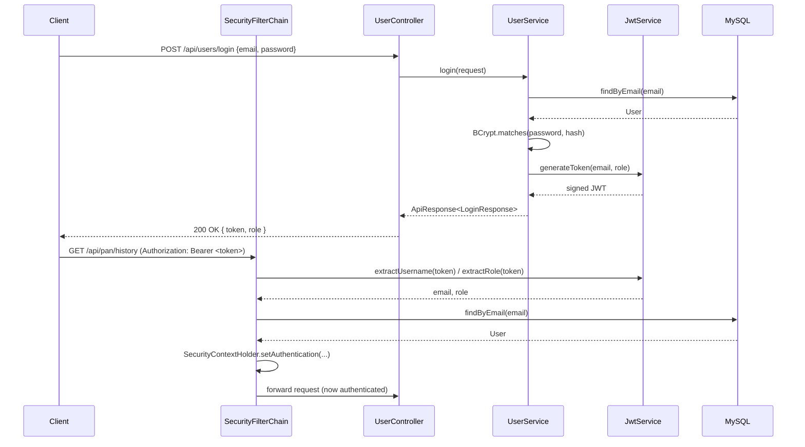
```mermaid
sequenceDiagram
    participant C as Client
    participant SC as SecurityFilterChain
    participant UC as UserController
    participant US as UserService
    participant JS as JwtService
    participant DB as MySQL

    C->>UC: POST /api/users/login {email, password}
    UC->>US: login(request)
    US->>DB: findByEmail(email)
    DB-->>US: User
    US->>US: BCrypt.matches(password, hash)
    US->>JS: generateToken(email, role)
    JS-->>US: signed JWT
    US-->>UC: ApiResponse<LoginResponse>
    UC-->>C: 200 OK { token, role }

    C->>SC: GET /api/pan/history  (Authorization: Bearer <token>)
    SC->>JS: extractUsername(token) / extractRole(token)
    JS-->>SC: email, role
    SC->>DB: findByEmail(email)
    DB-->>SC: User
    SC->>SC: SecurityContextHolder.setAuthentication(...)
    SC->>UC: forward request (now authenticated)
```

---

## 🧩 Class-by-Class Explanation

> Format for each class: **Why it exists → Responsibilities → Key methods → Dependencies → Interview angle → Common mistakes / gotchas found in this code.**

### `PanVerificationApplication`
- **Why:** Standard Spring Boot bootstrap class.
- **Responsibilities:** `main()` calls `SpringApplication.run(...)`; logs a startup banner.
- **Dependencies:** None beyond Spring Boot itself.
- 💡 **Interview angle:** "Explain what `@SpringBootApplication` actually is." (Answer: a meta-annotation combining `@Configuration`, `@EnableAutoConfiguration`, `@ComponentScan`.)

### `AdminInitializer`
- **Why:** Guarantees a usable admin account exists without manual SQL, every time the app starts fresh.
- **Responsibilities:** Implements `CommandLineRunner.run()`; checks `userRepository.existsByEmail("admin@gmail.com")`; if absent, builds and saves a `User` with role `ADMIN` and a BCrypt-hashed password `"admin123"`.
- **Dependencies:** `UserRepository`, `BCryptPasswordEncoder`.
- ⚠️ **Common mistake / risk:** The default admin credentials (`admin@gmail.com` / `admin123`) are hard-coded and would be created in **any** environment (dev, staging, prod) unless the account is manually removed/changed after first boot. In a real production system this should be gated by a profile check or removed after initial setup.

### `AppConfig`, `CorsConfig`, `RestTemplateConfig`, `SwaggerConfig`
- **Why:** Each is a focused `@Configuration` class — good separation-of-concerns instead of one giant config file.
- `AppConfig` → password encoder + `ObjectMapper` beans.
- `CorsConfig` → allows the known frontend origins (`5173` = Vite dev server, `3000` fallback) with credentials.
- `RestTemplateConfig` → builds a `RestTemplate` backed by Apache HttpClient5 with **SSL certificate validation disabled** (`loadTrustMaterial(null, (cert, authType) -> true)` + `NoopHostnameVerifier`). ⚠️ **This is intentionally called out in the code comment as being for UAT** — disabling SSL verification must never ship to production talking to a real endpoint; it's a classic interview red flag to be ready to explain *and* to say how you'd fix it (trust the specific Protean CA certificate instead of trusting everything).
- `SwaggerConfig` → registers a `bearerAuth` HTTP security scheme so Swagger UI shows an "Authorize" button for pasting a JWT.

### `AdminController`, `PanVerificationController`, `ProteanController`, `ReportController`, `UserController`
- **Why:** Thin HTTP-adapter layer — parse the request, delegate to a service, shape the response. None of these classes contain business logic themselves (good separation of concerns).
- **Common pattern:** `@Slf4j @RestController @RequestMapping(...) @RequiredArgsConstructor` — constructor injection via Lombok, consistent structured logging around each call.
- ⚠️ **Common mistake found:** `PanVerificationController` and `ReportController` cast `Authentication.getPrincipal()` to `User` (or use `@AuthenticationPrincipal User`) — this only works **because** `JwtAuthFilter` explicitly puts the `User` entity as the principal. If someone swapped in a different `AuthenticationProvider` (e.g., standard `DaoAuthenticationProvider` with `CustomUserDetailsService`), this cast would break, since `CustomUserDetailsService.loadUserByUsername()` returns a plain Spring Security `User`, not the app's own `User` entity. This is a **subtle inconsistency between the two authentication paths** in the codebase — see below.

### `ApiResponse<T>`, `DashboardResponse`, `LoginRequest/Response`, `PanRequest`, `PanVerificationRequest/Response`, `RegisterRequest`
- **Why:** Immutable, boilerplate-free data carriers using Java `record`s — no getters/setters/equals/hashCode to write by hand.
- 💡 **Interview angle:** "Why records instead of Lombok `@Data` classes for DTOs?" — Records are immutable by default (good for data that shouldn't change after creation, like a request payload), have built-in `equals()`/`hashCode()`/`toString()`, and are a native language feature (no annotation processor needed).
- ⚠️ **Dead DTOs:** `InputDataDto` and `RequestBody` are defined but **never used anywhere** in the controllers or services — they appear to be leftovers from an earlier design iteration (before `PanRequest`/`OpvRequest` were introduced).

### `AuditLog`, `PanVerification`, `ProteanOutputData`, `ProteanResponseHeader`, `Role`, `User`
- **Why:** JPA entities — the persistence model.
- `User implements UserDetails` **directly on the entity** — a common (if debated) shortcut that avoids a separate `UserPrincipal`/`UserDetailsImpl` wrapper class, at the cost of mixing persistence concerns with security concerns in one class.
- `PanVerification` uses `@PrePersist` to force-set `verifiedAt` at insert time regardless of what the caller set (defensive — matches the field's `updatable = false` intent, though the field-level default `= LocalDateTime.now()` combined with `@PrePersist` is slightly redundant).
- `Role` is a simple two-value `enum` (`USER`, `ADMIN`) — stored as its name string in the DB (`EnumType.STRING`), which is the safer choice over `ORDINAL` (adding a role later won't shift existing data).
- 💡 **Interview angle:** "Why `EnumType.STRING` over `EnumType.ORDINAL`?" — Ordinal stores the enum's position as an integer, which silently corrupts data if enum order ever changes; String is self-documenting and stable.

### `GlobalExceptionHandler`, `InvalidPanException`, `ResourceNotFoundException`, `UserAlreadyExistsException`
- **Why:** Centralizes error-to-HTTP-response mapping via `@RestControllerAdvice`, and gives the domain named, meaningful exception types instead of generic `RuntimeException`s everywhere.
- **Responsibilities:** Each `@ExceptionHandler` method logs and returns a `400 Bad Request` with the exception's message as the body.
- ⚠️ **Common mistakes found:**
  - `UserAlreadyExistsException` is defined but **never thrown** by `UserService` (duplicate registration currently surfaces as an unhandled `DataIntegrityViolationException`).
  - No handler exists for `RuntimeException` (used generically in `UserService.login()` and `ProteanService`) or for Bean Validation failures (`MethodArgumentNotValidException`) — both currently fall through to Spring Boot's default whitelabel error response.
  - All three handlers return **plain `String`** bodies, not a structured JSON error shape (inconsistent with the `ApiResponse` wrapper used elsewhere) — a good "what would you improve" talking point.

### `AuditLogRepository`, `PanVerificationRepository`, `ProteanOutputDataRepository`, `ProteanResponseHeaderRepository`, `UserRepository`
- **Why:** Spring Data JPA interfaces — no implementation code needed; Spring generates a proxy at runtime.
- **Key derived query methods:** `UserRepository.findByEmail`/`existsByEmail`; `PanVerificationRepository.findByUser`, `findByPanNumber`, `findByUserOrderByIdDesc`, `findAllByOrderByIdDesc`, and the **buggy** `findByPanNumberContaining(String, User)`.
- 💡 **Interview angle:** "How does Spring Data JPA turn a method name into SQL?" — It parses the method name after `findBy`/`existsBy`/etc. into property expressions and keywords (`Containing`, `OrderBy...Desc`, `And`, `Or`...), and each parameter binds **positionally** to each parsed condition — which is exactly why `findByPanNumberContaining(String pan, User user)` is broken: the name only describes one condition, but two parameters are declared.

### `CustomUserDetailsService`, `JwtAuthFilter`, `JwtService`, `SecurityConfig`
- **Why:** JWT-based, stateless Spring Security setup.
- `CustomUserDetailsService` implements the standard `UserDetailsService` contract — but ⚠️ **is not actually referenced by `SecurityConfig`** (there's no `AuthenticationProvider`/`DaoAuthenticationProvider` bean wiring it in). Authentication in this app happens entirely through `JwtAuthFilter` manually querying `UserRepository` and building the `Authentication` object itself — `CustomUserDetailsService` appears to be **unused, dead code**, likely written in an earlier iteration before the filter-based approach was finalized, or kept for future use with `AuthenticationManager`-based flows (e.g., if a non-JWT login path were ever added).
- `JwtService` handles signing/parsing with `io.jsonwebtoken` (JJWT) using an `HS256` key derived from `jwt.secret`.
- `JwtAuthFilter` — see [Authentication Flow](#-authentication-flow) above.
- `SecurityConfig` — disables CSRF (correct for a stateless, non-browser-form API), enables CORS, defines route-level authorization rules, and inserts `JwtAuthFilter` before Spring's `UsernamePasswordAuthenticationFilter`.
- ⚠️ **Common mistake / interview trap:** No `SessionCreationPolicy.STATELESS` is explicitly set on the `HttpSecurity` builder. It happens to work because nothing in the app relies on HTTP sessions, but a thorough JWT setup normally sets this explicitly (`.sessionManagement(s -> s.sessionCreationPolicy(SessionCreationPolicy.STATELESS))`) to guarantee Spring Security never creates a `JSESSIONID` cookie.

### `AuditService`
- **Why (as designed):** A single `saveLog(action, username)` method to persist an `AuditLog` row.
- ⚠️ **Reality:** Never called by anything. Dead code today, but a clean example of a feature that's "half-built" — the data model, repository, and service exist, but the wiring into the actual request flow was never finished.

### `CertificateService`
- **Why (as designed):** Loads a `PrivateKey` from a PKCS12 keystore (`KeyStore.getInstance("PKCS12")`) using the `opv.pfx-file`/`opv.pfx-password` properties.
- ⚠️ **Reality:** Never called. `SignatureService` re-implements its own, separate keystore-loading logic (using `KeyStore.getInstance("JKS")` instead of `"PKCS12"`, and reading the file via the classpath rather than the filesystem). This is **duplicated, inconsistent logic** — a strong candidate for refactoring: one shared `CertificateService`/`KeyStoreService` should be the single source of truth.

### `DashboardService`
- **Why:** Simple aggregation — counts rows in `users` and `pan_verification`.
- **Key method:** `dashboard()` → `DashboardResponse(userRepository.count(), panVerificationRepository.count())`.

### `PanVerificationService` (the heart of the application)
- **Why:** Orchestrates the entire PAN verification use case.
- **Key method `verify()`:** formats DOB for Protean (`dd/MM/yyyy`), builds a `PanRequest`, calls `ProteanService`, parses the raw JSON response with Jackson's `JsonNode` tree API, builds and saves a `PanVerification` row **and** a `ProteanResponseHeader` (+ cascaded `ProteanOutputData` rows), and returns a `PanVerificationResponse`. It **always saves a record**, even on failure — that's the audit-trail design decision mentioned earlier.
- **Key method `getResponseMessage()`:** a `switch` expression (Java 14+ arrow syntax) translating Protean's numeric `response_Code` into a human-readable message — a nice, readable example of modern Java `switch`.
- **Other methods:** `exportPdf()`/`exportExcel()` (role-aware record fetching + delegation to the generators), `search()`, `getHistory()`.
- 💡 **Interview angle:** "Why not wrap the DB save + Protean call in `@Transactional`?" — Good question to be ready for: currently, if the app crashes between saving `PanVerification` and saving `ProteanResponseHeader`, you'd get an orphaned verification row with no header. Adding `@Transactional` to `verify()` would make that atomic (though the *external* Protean HTTP call itself can never be "rolled back," which is a classic distributed-transaction limitation worth discussing).

### `ProteanService`
- **Why:** Encapsulates all HTTP mechanics of talking to Protean's OPV API.
- **Responsibilities:** builds the signature over the input-data JSON, assembles custom HTTP headers Protean requires (`User_ID`, `Records_count`, `Request_time`, `Transaction_ID`, `Version`), POSTs via `RestTemplate`, and logs the full request/response cycle in detail (useful for debugging integration issues with a third-party API where you don't control the server).
- **Dependencies:** `SignatureService`, `RestTemplate` (from `RestTemplateConfig`), `ObjectMapper`.
- 💡 **Interview angle:** "How would you avoid logging sensitive PII (PAN, name, DOB) at INFO level in production?" — a fair critique of the current verbose logging (see [Logging](#-logging)).

### `ReportService`
- **Why (as designed):** A dedicated service for generating "all records" PDF/Excel reports (no role/user filtering) via `repository.findAll()`.
- ⚠️ **Reality:** Fully implemented and correct, but **not called from any controller** — `ReportController` uses `PanVerificationService.exportPdf/exportExcel` instead (which *does* have role-based filtering). This looks like `ReportService` was the first version, later superseded by the role-aware logic added directly to `PanVerificationService`, without deleting the now-redundant class.

### `SignatureService`
- **Why:** Implements the PKCS7/CMS digital-signature step Protean's OPV API mandates.
- **Key method `generateSignature()`:** registers the BouncyCastle (`"BC"`) security provider, loads the private key + certificate from the JKS keystore, builds a `CMSSignedDataGenerator` with a `SHA1withRSA` content signer, generates an **attached** (non-detached, `encapsulate=true`) CMS signed-data structure, and Base64-encodes it.
- 💡 **Interview angle:** "What's the difference between a detached and an attached (encapsulated) CMS signature, and why does it matter here?" — Attached means the original signed data is embedded inside the signature blob itself; detached means the signature is separate from the data. Protean's API spec (per the code's comment referencing "Protean's official `pkcs7gen.java`") requires the attached form.
- ⚠️ **Note:** `SHA1withRSA` uses SHA-1, a cryptographically weakened hash algorithm by modern standards — but this isn't a design choice the developer is free to change, since it must match **exactly** what the external Protean API expects/validates. Good to be able to explain *why* a "weak" algorithm is still correct here: compatibility with a third-party spec, not a security oversight in this codebase's own design.

### `UserService`
- **Why:** Registration + login business logic.
- **Key methods:** `register()` (hashes the password, forces `Role.USER`), `login()` (verifies credentials, issues JWT).

### `Constants`
- **Why (as designed):** Holds string constants `VERIFIED`, `FAILED`, `MOCK_API`.
- ⚠️ **Reality:** Never referenced anywhere else in the codebase — dead code (the actual status strings used at runtime, e.g. `"SUCCESS"`/`"FAILED"`/`"VALID"`/`"INVALID"`, are hard-coded as string literals directly in `PanVerificationService`, `PdfGenerator`, and `ExcelGenerator` instead of using this class).

### `ExcelGenerator`, `PdfGenerator`
- **Why:** Produce polished, branded, role-aware downloadable reports.
- **Responsibilities:** Both build a "banner" header, a 4-box summary (Total/Valid/Invalid/Pending), a color-coded status column (green=VALID, red=INVALID, amber=other), and — for `ExcelGenerator` — a second "Summary" sheet plus an Excel auto-filter on the data range.
- 💡 **Interview angle:** these two classes are a great example to walk through if asked to "explain a tricky/interesting piece of code you wrote" — they show UI/UX thinking (color coding, freeze panes, merged cells) applied to a backend service, which is memorable in an interview.

---

## 👨‍🏫 Code Walkthrough

**`application.properties`** — central configuration:
```properties
spring.datasource.url=jdbc:mysql://localhost:3306/pan_verification_db
spring.datasource.username=root
spring.datasource.password=********      # ⚠️ hard-coded in the file, see Security section
spring.jpa.hibernate.ddl-auto=update     # auto-syncs schema — fine for dev, risky for prod
spring.jpa.show-sql=true                 # prints every SQL statement to the log
opv.pfx-file=certs/output.jks            # keystore path (classpath-relative, used by SignatureService)
opv.pfx-password=********
protean.user-id=V0024301                 # Protean-assigned client ID
protean.version=4                        # Protean OPV API version being targeted
protean.uat-url=https://.../PanInquiryAPIBackEnd   # the UAT (test) endpoint, not production
jwt.secret=********                      # HMAC signing key, 64+ chars (HS256 needs ≥32 bytes)
logging.level.root=INFO
logging.level.com.verify.panverification=DEBUG
```
⚠️ Every secret here (DB password, JWT secret, keystore password) is committed in plaintext to the properties file rather than pulled from environment variables. Flagged with detail in [Security](#-security).

**`SecurityConfig`** — walked through line-by-line in [Authentication Flow](#-authentication-flow).

**Controller pattern** (using `UserController.login` as the template):
```java
@PostMapping("/login")
public ResponseEntity<ApiResponse<LoginResponse>> login(@RequestBody LoginRequest request) {
    // 1. Delegate immediately to the service — controller does no logic itself
    ResponseEntity<ApiResponse<LoginResponse>> response =
            ResponseEntity.ok(service.login(request));
    return response;
}
```
This "thin controller" pattern is consistent across all five controllers — makes unit testing the service layer independent of HTTP concerns straightforward (though, per [Testing](#-testing), no such unit tests exist yet).

**DTO (record) pattern:**
```java
public record PanVerificationRequest(
    @NotBlank @Pattern(regexp = "[A-Z]{5}[0-9]{4}[A-Z]{1}") String panNumber,
    @NotBlank String fullName,
    @NotBlank String fathername,
    @NotNull LocalDate dob
) {}
```
Bean Validation annotations sit directly on record components — this is how you validate immutable records in modern Spring; the controller must add `@Valid` on the parameter for these to actually be enforced (which `PanVerificationController.verify()` correctly does).

**Entity pattern (`PanVerification`):** Lombok `@Data` (getters/setters/equals/hashCode/toString) + `@Builder` (fluent construction) + `@NoArgsConstructor`/`@AllArgsConstructor` (JPA requires a no-args constructor). `@PrePersist` is a JPA lifecycle callback executed automatically right before the `INSERT`.

**Exception pattern:**
```java
public class InvalidPanException extends RuntimeException {
    public InvalidPanException(String message) {
        super(message);
        log.warn("InvalidPanException thrown: {}", message); // logs at construction time
    }
}
```
⚠️ Note: `InvalidPanException` is defined and has a handler in `GlobalExceptionHandler`, but a search of the codebase shows it is **never actually thrown** anywhere — the PAN format is instead enforced purely by the `@Pattern` regex on `PanVerificationRequest`, which produces a standard validation error, not this custom exception.

**Utility/mapper/enum classes:** There is no dedicated "Mapper" package — entity-to-DTO mapping is done manually and inline inside services (e.g., `PanVerificationService.verify()` manually constructs `ProteanOutputData` objects field-by-field from a Jackson `JsonNode`). 💡 If asked "would you introduce MapStruct here?" — a fair answer is yes, for the repetitive DTO↔entity mapping, though the current manual approach is easy to follow for a project this size.

---

## 💼 Business Logic Explanation

- **Why validation happens on `PanVerificationRequest`:** A malformed PAN (wrong format) sent to Protean would waste an external API call (Protean likely charges per verification or rate-limits) and return a Protean-side error instead of a clean client-side error — validating locally first is both cheaper and gives a faster, clearer error to the user.
- **Why every verification attempt is persisted, even failures:** This is a **compliance/audit system**. Regulators or internal auditors need to see *every* attempt, not just successful ones, to prove due diligence was performed — this is why `verificationStatus` defaults to `"FAILED"` and the row is saved unconditionally.
- **Why the digital signature step exists at all:** Protean's OPV API is a government financial-data service; it requires cryptographic proof that the request genuinely came from the registered, credentialed client (the organization holding the DSC), not just anyone who knows the URL. This is non-repudiation, not just authentication.
- **Why role-based filtering happens in the service layer (not the repository or controller):** `PanVerificationService` checks `currentUser.getRole() == Role.ADMIN` before deciding which repository method to call. Doing this in the service keeps the authorization *business rule* ("admins see everything, users see only their own") in one place, separate from both the HTTP layer and the raw data-access layer.
- **Why exceptions are thrown instead of returning `null`/error codes:** Following standard Java/Spring practice — exceptions make failure states impossible to silently ignore, and `GlobalExceptionHandler` gives one centralized place to decide the HTTP-level consequence of each failure type (even though, as noted, coverage of that centralization is currently incomplete).

---

## 🔁 End-to-End Request Flow (One API, Fully Traced)

**Chosen API: `POST /api/pan/verify`** — the core feature, so it's the most valuable one to be able to narrate in an interview.

```
1. HTTP Request
   POST /api/pan/verify
   Authorization: Bearer eyJhbGciOi...
   { "panNumber":"ABCDE1234F", "fullName":"John Doe",
     "fathername":"Richard Doe", "dob":"1990-01-01" }
        │
2. JwtAuthFilter
   - extracts + verifies the JWT → email="john@x.com", role="USER"
   - loads User from UserRepository
   - sets SecurityContext authentication
        │
3. Controller: PanVerificationController.verify()
   - @Valid triggers Bean Validation on PanVerificationRequest
     (panNumber regex, NotBlank / NotNull checks)
   - if invalid → 400 before the method body even runs
   - Authentication.getPrincipal() cast to User → currentUser
        │
4. DTO → Service
   panVerificationService.verify(request, currentUser)
        │
5. Business Logic (PanVerificationService)
   - format dob to dd/MM/yyyy for Protean
   - build a PanRequest
        │
6. ProteanService.verifyPan(panRequest)
   - SignatureService.generateSignature(inputDataJson)
     → loads JKS keystore → BouncyCastle CMS signing → Base64 signature
   - builds OpvRequest + custom HTTP headers
   - RestTemplate.postForEntity(protean.uat-url, entity, String.class)
        │
7. Repository / SQL (after the Protean call returns)
   - parse responseBody JSON with Jackson
   - panVerify.save(verification)         → INSERT INTO pan_verification
   - headerRepository.save(header)        → INSERT INTO protean_response_header
                                             (+ cascaded INSERT INTO protean_output_data)
        │
8. Response DTO
   new PanVerificationResponse(panNumber, panStatus, verificationStatus, message)
        │
9. Controller wraps it
   new ApiResponse(true, "PAN Verified", response)
        │
10. JSON Response
    200 OK
    { "success": true, "message": "PAN Verified",
      "data": { "panNumber":"ABCDE1234F", "panStatus":"E",
                "verificationStatus":"SUCCESS", "message":"Success" } }
```

---

## 🗃 SQL & JPA Queries

All persistence goes through **Spring Data JPA** — there is no raw `@Query`/native SQL in the codebase; every query is either a **generated CRUD method** (`save`, `findAll`, `count`) inherited from `JpaRepository`, or a **derived query method** parsed from the method name.

**Insert:** `panVerify.save(verification)` → Hibernate issues `INSERT INTO pan_verification (...) VALUES (...)`. Because `id` uses `GenerationType.IDENTITY`, Hibernate cannot batch these inserts (each needs the DB-generated key back immediately) — a known JPA performance trade-off worth mentioning if asked about batch inserts.

**Update:** Nothing in the app currently calls `save()` on a pre-existing entity with a set `id` (which is what would trigger an `UPDATE` in JPA's dirty-checking/merge semantics) — every `save()` call is on a brand-new entity, so this app is effectively **insert-only**.

**Delete:** No delete operation exists anywhere in the code — consistent with the audit-trail design.

**Select — derived query examples:**
```java
Optional<User> findByEmail(String email);
// → SELECT * FROM users WHERE email = ?

List<PanVerification> findByUserOrderByIdDesc(User user);
// → SELECT * FROM pan_verification WHERE user_id = ? ORDER BY id DESC

List<PanVerification> findAllByOrderByIdDesc();
// → SELECT * FROM pan_verification ORDER BY id DESC
```

**Joins:** Handled implicitly through JPA relationship annotations rather than explicit SQL joins — e.g., accessing `panVerification.getUser().getUsername()` inside `PdfGenerator`/`ExcelGenerator` triggers a **lazy-loaded** join query per record (`@ManyToOne(fetch = FetchType.LAZY)`), since `User` is fetched lazily.

⚠️ **N+1 query risk:** Because `User` is `LAZY` on `PanVerification`, and the report generators loop over a `List<PanVerification>` calling `p.getUser().getUsername()` for every row, **each row can trigger a separate `SELECT * FROM users WHERE id = ?`** if the records aren't already loaded within the same persistence context / transaction. This is a classic, very commonly asked interview topic — the fix would be a JPQL `JOIN FETCH` or an `@EntityGraph` on the repository method used to fetch the list before generating the report.

**Indexes:** Only the implicit indexes Hibernate/MySQL create automatically: the primary key (`id`) on every table, and the `UNIQUE` constraints on `users.username`/`users.email` (which MySQL backs with a unique index). ⚠️ No explicit index exists on `pan_verification.pan_number` or `pan_verification.user_id`, even though both are searched/filtered on frequently (`findByPanNumber`, `findByUser*`, the `search` endpoint) — a real, addable optimization for a growing dataset.

**Optimization opportunities (see also [Performance](#-performance)):** add `@JoinFetch`/`@EntityGraph` for reports, add explicit indexes on `pan_number` and `user_id`, wrap `verify()` in `@Transactional`.

---

## 🚨 Exception Handling

**Global Exception Handler (`@RestControllerAdvice`):** Catches exactly three custom exception types and returns `400 Bad Request` with a plain-text body for each:

| Exception | Thrown by | HTTP status returned |
|---|---|---|
| `ResourceNotFoundException` | ⚠️ Defined, but not thrown anywhere in the reviewed code | 400 |
| `InvalidPanException` | ⚠️ Defined, but not thrown anywhere in the reviewed code (PAN format is enforced via `@Pattern` instead) | 400 |
| `UserAlreadyExistsException` | ⚠️ Defined, but not thrown anywhere in the reviewed code (`UserService.register()` doesn't check for duplicates before saving) | 400 |

**Custom exceptions:** Each extends `RuntimeException` (unchecked, so callers aren't forced to declare/catch them) and logs a `warn`-level message right in its constructor — a nice touch for traceability, since the log line is written the instant the exception is created, even if it's caught somewhere unexpected later.

**Validation errors:** Bean Validation (`@Valid` + `@NotBlank`/`@Pattern`/`@NotNull`) is used on `PanVerificationRequest`. When validation fails, Spring's default `MethodArgumentNotValidException` handling kicks in (there's no custom handler for it), returning Spring Boot's default structured `400` error body.

**HTTP status codes actually used in this app today:** `200 OK` (success), `400 Bad Request` (the three custom exceptions + validation failures), and an implicit `500 Internal Server Error` for anything else uncaught (e.g., the login failures, the Protean-call `RuntimeException`, and the search-endpoint bug). 💡 A strong interview answer: *"The exception layer is a good skeleton but has a gap — several real failure paths (bad login, external API failure) currently fall through to a generic 500 instead of a meaningful 401/502; that's exactly what I'd tighten up next."*

---

## 📝 Logging

**Where logs are written:** Console (stdout) **and** a rolling file at `logs/pan-verification.log`, rotated daily (`logs/pan-verification.<yyyy-MM-dd>.log`), retained for 30 days (`maxHistory`), configured in `logback-spring.xml`.

**Log levels in use:**
- `com.verify.panverification` (the app's own code) → `DEBUG`
- `org.springframework.security` → `INFO`
- `org.hibernate.SQL` → `DEBUG` (combined with `spring.jpa.show-sql=true`, this means every SQL statement is printed)
- Root logger → `INFO`

**Best practices observed:** consistent `@Slf4j` usage everywhere (no `System.out.println`), structured parameterized logging (`log.info("... {}", var)` rather than string concatenation — avoids the cost of building the string when the log level is disabled), clear `info`/`debug`/`warn`/`error` level discipline (e.g., expected business failures logged at `warn`, unexpected failures at `error`).

⚠️ **Best practice violated — PII in logs:** `ProteanService` logs the full PAN number, name, father's name, and DOB at `INFO` level for every request/response (`log.info("outputData[{}] : pan : {}", ...)`). In a real compliance-sensitive system, PAN numbers and names are personally identifiable information (PII) and generally shouldn't be logged in plaintext at `INFO` (which typically ships to centralized/long-retained log storage) — this would normally be masked or logged only at `DEBUG` with restricted log access.

---

## 🔒 Security

- **JWT:** `HS256` signing via `io.jsonwebtoken`, secret pulled from `jwt.secret`. `Keys.hmacShaKeyFor(SECRET.getBytes())` requires the secret be at least 256 bits (32 bytes) for HS256 — the configured secret in `application.properties` is 64+ characters, so it satisfies that minimum.
- **Password encoding:** `BCryptPasswordEncoder` (adaptive, salted hashing — resistant to rainbow-table and brute-force attacks better than plain SHA/MD5).
- **Spring Security filters:** Custom `JwtAuthFilter` inserted before `UsernamePasswordAuthenticationFilter` in the chain; CSRF disabled (correct for a stateless token-based API with no browser form submissions); CORS enabled via `Customizer.withDefaults()`, backed by the explicit `CorsConfig` bean.
- **Authentication:** Manual, filter-based — not the classic `AuthenticationManager`/`AuthenticationProvider` flow (see the `CustomUserDetailsService` dead-code note above).
- **Authorization:** Declarative, route-based (`hasRole`, `hasAnyRole`, `authenticated()`) in `SecurityConfig`.
- **CSRF:** Disabled — appropriate here since the app issues no cookies/session state that a CSRF attack could exploit; JWTs sent via an `Authorization` header aren't automatically attached by the browser the way cookies are, which is what makes token-header auth inherently CSRF-resistant.
- **CORS:** Explicitly scoped to two known local frontend origins with `allowCredentials(true)` — appropriately restrictive rather than a wildcard `*`.

⚠️ **Security issues found in this repository (be ready to discuss these honestly in an interview — recognizing them is itself a strong signal):**
1. **Hard-coded secrets in `application.properties`** — DB password, JWT signing secret, and keystore password are committed in plaintext. Should be externalized via environment variables / a secrets manager (Spring supports `${DB_PASSWORD}` placeholders resolved from the environment) and the file should be excluded via `.gitignore` (it currently is **not**).
2. **SSL certificate validation disabled** in `RestTemplateConfig` (`NoopHostnameVerifier`, trust-all `SSLContext`) — explicitly commented as being for UAT, but there is no separate, safer configuration for a production profile in the repo.
3. **Duplicate default admin credentials are predictable** (`admin@gmail.com` / `admin123`) and auto-created on every fresh environment.
4. **No rate limiting** on `/api/pan/verify` or `/api/users/login` — a brute-force login attempt or an accidental client-side retry loop could hammer both this API and the (presumably paid/rate-limited) Protean API.
5. **PII logged at INFO level** (see [Logging](#-logging)).

---

## ✅ Validation

| Field | Rule | Why |
|---|---|---|
| `PanVerificationRequest.panNumber` | `@NotBlank`, `@Pattern("[A-Z]{5}[0-9]{4}[A-Z]{1}")` | Enforces the real, fixed 10-character Indian PAN format before wasting an external API call |
| `PanVerificationRequest.fullName` | `@NotBlank` | A verification request without a name to match against is meaningless |
| `PanVerificationRequest.fathername` | `@NotBlank` | Required by Protean's OPV request schema |
| `PanVerificationRequest.dob` | `@NotNull` (typed as `LocalDate`, so format correctness is guaranteed by Jackson's date parsing, not a regex) | Required field for the match |

⚠️ **Not validated:** `RegisterRequest` and `LoginRequest` have **zero** Bean Validation annotations — a blank email/password would currently pass straight through to the service layer (and likely fail only when it hits a DB constraint or a `null`-pointer scenario deeper in). This is a legitimate, honest gap to mention if asked "what would you add for more robustness?"

---

## 🐳 Docker

⚠️ **Not present in this repository.** There is no `Dockerfile`, `docker-compose.yml`, or any container-related file in the uploaded project. If you're asked about Docker in an interview for this project, the honest and correct answer is: *"This particular repo doesn't containerize the app yet — but here's how I would do it,"* followed by a sketch such as:

```dockerfile
# Example only — not present in the repository
FROM eclipse-temurin:21-jre
WORKDIR /app
COPY target/PanVerification-0.0.1-SNAPSHOT.jar app.jar
EXPOSE 8080
ENTRYPOINT ["java", "-jar", "app.jar"]
```

paired with a `docker-compose.yml` sketch like this (also **not present** in the repo — illustrative only):

```yaml
# Example only — not present in the repository
version: "3.8"
services:
  app:
    build: .
    ports:
      - "8080:8080"          # container:host — matches embedded Tomcat's default port
    environment:
      SPRING_DATASOURCE_URL: jdbc:mysql://mysql:3306/pan_verification_db
      SPRING_DATASOURCE_USERNAME: root
      SPRING_DATASOURCE_PASSWORD: ${DB_PASSWORD}
      JWT_SECRET: ${JWT_SECRET}
      OPV_PFX_PASSWORD: ${OPV_PFX_PASSWORD}
    depends_on:
      - mysql
    networks:
      - panverify-net
  mysql:
    image: mysql:8
    environment:
      MYSQL_ROOT_PASSWORD: ${DB_PASSWORD}
      MYSQL_DATABASE: pan_verification_db
    volumes:
      - mysql-data:/var/lib/mysql   # named volume — survives container recreation
    networks:
      - panverify-net
volumes:
  mysql-data:
networks:
  panverify-net:
```

**Containers:** one for the Spring Boot app, one for MySQL — kept separate so the database survives app restarts/redeploys.
**Networks:** a single user-defined bridge network (`panverify-net`) lets the two containers resolve each other by service name (`mysql`) instead of hard-coded IPs.
**Volumes:** a named volume (`mysql-data`) persists MySQL's data directory outside the container's writable layer, so `docker compose down` doesn't wipe the database.
**Ports:** only `8080` (the app) would need to be published to the host; MySQL's `3306` can stay internal to the Docker network unless external DB tools need direct access.
**How you'd deploy it (once these files existed):** `docker compose up --build -d`, then apply the JKS keystore either by baking it into the image (fine for a private repo) or mounting it as a secret/volume (better for anything public).

---

## 🚀 Deployment

⚠️ **No deployment configuration (CI/CD pipeline, cloud manifests, `application-prod.properties`, etc.) exists in this repository.** What *is* present that's relevant to deployment:

- **Build artifact:** `mvn clean package` produces `target/PanVerification-0.0.1-SNAPSHOT.jar` — a standard executable Spring Boot fat JAR, runnable anywhere Java 21 is installed (`java -jar ...`).
- **Environment variables needed for a real deployment** (currently hard-coded, should be externalized): `spring.datasource.url/username/password`, `jwt.secret`, `opv.pfx-password`, `protean.user-id`, `protean.uat-url` (which would also need to become a **production** Protean URL, not the UAT one currently configured).
- **Production configuration gap:** There is only a single `application.properties` — no `application-prod.properties`/Spring profiles (`@Profile`, `spring.profiles.active`) to separate dev/UAT/prod concerns (e.g., the SSL-bypassing `RestTemplateConfig` must never run against a real production Protean endpoint).

---

## 🧪 Testing

**What exists:** exactly one test — `PanVerificationApplicationTests.contextLoads()` — which only verifies that the full Spring application context starts up without error. This is Spring Boot's generated default test, left essentially untouched.

**What's declared but not used:** `pom.xml` includes `spring-boot-starter-data-jpa-test`, `spring-boot-starter-security-test`, `spring-boot-starter-validation-test`, and `spring-boot-starter-webmvc-test` — meaning the **infrastructure for real unit/integration tests (including Mockito, which ships with `spring-boot-starter-test`-family dependencies) is available**, but ⚠️ **no actual unit tests, controller slice tests (`@WebMvcTest`), or repository tests (`@DataJpaTest`) have been written.**

**Manual testing tools available:** **Swagger UI** (`/swagger-ui.html`) for interactive testing with the "Authorize" bearer-token button; **Postman** (implied by the "test" style endpoints like `/api/pan/test-cert`, `/api/pan/test-sign`, and `/api/protean/proteanverify`, which look purpose-built for manual/Postman-driven verification of the signing and Protean-integration pieces independent of the full save-to-DB flow).

💡 If asked "what tests would you add first?": (1) a `@DataJpaTest` for `PanVerificationRepository.findByPanNumberContaining` — which would **immediately surface the known bug**, making it a great example of "tests catch real issues"; (2) a `@WebMvcTest` for `PanVerificationController` mocking `PanVerificationService`, asserting the `@Valid` regex rejects a bad PAN; (3) a unit test for `JwtService` round-tripping generate→extract.

---

## ⚡ Performance

**What's already good:**
- `List<PanVerification>` fetches use `ORDER BY id DESC` pushed down to the database rather than sorted in memory.
- Lazy loading (`FetchType.LAZY`) is used for `PanVerification.user`, avoiding an unnecessary join on every simple query — though, as noted, this becomes a liability (N+1) specifically inside the report generators.

**What's missing / could be added (all currently **absent** from the codebase — noted honestly):**
- **Caching:** ⚠️ None. `DashboardService.dashboard()` runs two full `COUNT(*)` queries on every single call — a natural candidate for a short-lived cache (`@Cacheable`) if the dashboard is polled frequently.
- **Pagination:** ⚠️ None. `getHistory()`, `search()`, and the report exports all load the **entire** result set into memory (`List<PanVerification>`) with no `Pageable`/`LIMIT`/`OFFSET`. This will not scale once the `pan_verification` table grows large — a strong, concrete "what would you improve" answer.
- **Connection pooling:** Present implicitly — Spring Boot auto-configures **HikariCP** as the default connection pool whenever `spring-boot-starter-data-jpa` + a JDBC driver are on the classpath, even though it's never explicitly configured/tuned in `application.properties`.
- **Transactions:** ⚠️ No `@Transactional` annotations anywhere in the service layer — multi-step save sequences (like `verify()`'s two/three separate `save()` calls) are not currently atomic.
- **Query optimization:** See the N+1 and missing-index notes in [SQL & JPA Queries](#-sql--jpa-queries).

---

## 🧗 Known Issues / Challenges Faced

| Problem | Cause | Suggested Fix | What it teaches |
|---|---|---|---|
| `findByPanNumberContaining(String pan, User user)` will likely fail at runtime for admin searches | The derived-query method name encodes only one condition but the method takes two parameters | Rename to `findByPanNumberContainingAndUser(String pan, User user)` (matches Spring Data's naming rules), or switch to an explicit `@Query` | Deep understanding of how Spring Data JPA parses method names — a genuinely great, real-world debugging story for interviews |
| Duplicate registration isn't rejected cleanly | `UserService.register()` never checks `existsByEmail`/`existsByUsername` before saving, and `UserAlreadyExistsException` (though defined) is never thrown | Add an existence check before save, throw `UserAlreadyExistsException` | Defensive programming — a defined-but-unused exception is a code smell worth catching in review |
| Login failures return a generic 500 instead of 401 | `UserService.login()` throws plain `RuntimeException`, which `GlobalExceptionHandler` doesn't handle | Introduce a dedicated `InvalidCredentialsException` + handler returning `401` | Mapping business failures to the *correct* HTTP semantics, not just "any" error code |
| Reports may trigger N+1 queries | `PanVerification.user` is lazily fetched, and generators loop calling `.getUser()` per row | `@EntityGraph`/`JOIN FETCH` on the fetching repository method | The most commonly asked JPA performance interview topic — directly demonstrable in this exact codebase |
| `CertificateService` and `SignatureService` duplicate keystore-loading logic with different `KeyStore` types (`PKCS12` vs `JKS`) | Iterative development — `SignatureService` was likely extended/rewritten without removing the earlier `CertificateService` | Consolidate into one shared keystore-loading service | Recognizing and cleaning up duplicated logic during code review |
| Secrets committed in `application.properties` | No externalized configuration / secrets management set up yet | Use environment variables (`${JWT_SECRET}`) + `.gitignore` the properties file, or a secrets manager | Security hygiene for anything handling financial/PII data |

---

## 🔮 Improvements (Future Work)

- Fix the `findByPanNumberContaining` derived-query bug.
- Add `@Transactional` to multi-step service methods (`verify()`).
- Add pagination (`Pageable`) to history/search/report endpoints.
- Add caching (`@Cacheable`) to `DashboardService`.
- Externalize all secrets to environment variables; remove them from version control.
- Add explicit `@Query`/indexes for `pan_number` and `user_id`.
- Wire `AuditService` into the actual request flow (login, register, verify) so `audit_log` is actually populated.
- Consolidate `CertificateService` and `SignatureService`'s duplicated keystore logic.
- Throw `UserAlreadyExistsException` from `UserService.register()`; add a proper `401` path for bad login.
- Add real unit/integration tests (`@DataJpaTest`, `@WebMvcTest`, `Mockito`-based service tests) — the dependencies are already on the classpath.
- Add Docker + Docker Compose (app + MySQL) for one-command local setup.
- Add a `SessionCreationPolicy.STATELESS` declaration to `SecurityConfig` for explicitness.
- Add a refresh-token flow if the JWT expiry needs to be shortened for security without forcing frequent re-logins.
- Mask/redact PII (PAN, name, DOB) in log output, or drop those fields to `DEBUG`-only with restricted log access.

---

## 🎯 50 Interview Questions From This Exact Project

> Each entry: **Question → Expected answer (grounded in this codebase) → Why interviewers ask it.**

**1. Walk me through what happens when `/api/pan/verify` is called.**
→ Trace: `JwtAuthFilter` authenticates → `@Valid` validates the PAN regex → `PanVerificationService.verify()` formats the DOB, calls `ProteanService` (which signs the payload via `SignatureService` and POSTs to Protean), parses the JSON response, saves `PanVerification` + `ProteanResponseHeader`(+`ProteanOutputData`), and returns a `PanVerificationResponse`.
→ *Tests whether you actually understand your own request lifecycle, not just that it "works."*

**2. Why did you use JWT instead of session-based authentication?**
→ Statelessness — no server-side session store needed, scales horizontally, and fits a pure REST API consumed by a separate SPA frontend (evidenced by the CORS config allowing a Vite dev server).
→ *Classic auth-design fundamentals check.*

**3. How does `JwtAuthFilter` know who the user is?**
→ It extracts the email from the JWT subject claim, looks the `User` up via `UserRepository`, and manually constructs a `UsernamePasswordAuthenticationToken` with that `User` as the principal, placed into `SecurityContextHolder`.
→ *Tests understanding of the Spring Security filter chain and `SecurityContext`.*

**4. Why is `CustomUserDetailsService` unused in this project?**
→ Because authentication doesn't go through Spring Security's standard `AuthenticationManager`/`AuthenticationProvider` flow — `JwtAuthFilter` builds the `Authentication` object manually. `CustomUserDetailsService` is dead code, likely a leftover from an earlier or partially-started approach.
→ *Tests whether you can spot and honestly explain dead/unused code in your own project — a strong signal of real code ownership.*

**5. What's the bug in `findByPanNumberContaining`?**
→ The method name encodes one derived-query condition but declares two parameters (`pan`, `user`); Spring Data can't map the second parameter, causing a runtime query-creation failure.
→ *Directly tests Spring Data JPA method-name-parsing knowledge.*

**6. How would you fix that bug?**
→ Rename to `findByPanNumberContainingAndUser(String pan, User user)`, or write an explicit `@Query("SELECT p FROM PanVerification p WHERE p.panNumber LIKE %:pan% AND p.user = :user")`.
→ *Tests whether you know both the naming-convention fix and the escape hatch (`@Query`).*

**7. Why do you save a `PanVerification` row even when Protean's call fails?**
→ Compliance/audit design — every attempt must be traceable, not just successes.
→ *Tests understanding of the actual business domain (KYC/compliance), not just the code.*

**8. Explain the digital signature step. Why SHA1withRSA specifically?**
→ Protean's OPV API spec mandates a PKCS7/CMS signature using SHA1withRSA — it's a third-party contractual requirement, not a security choice made by this app.
→ *Tests whether you understand the difference between "weak crypto by choice" vs. "compatibility constraint."*

**9. What's the difference between an attached and a detached CMS signature, and which does this project use?**
→ Attached embeds the signed data inside the signature; detached keeps them separate. This project uses attached (`encapsulate=true` in `CMSSignedDataGenerator.generate(...)`).
→ *Tests depth on the crypto library actually used.*

**10. Why is `RestTemplate` configured to bypass SSL certificate validation?**
→ To connect to Protean's UAT (test) endpoint, which likely uses a self-signed/untrusted certificate. Explicitly a UAT-only workaround — must not be used against a real production endpoint.
→ *Tests security awareness and whether you'll admit a real weakness in your own code.*

**11. How would you make that safe for production?**
→ Trust only Protean's actual production CA certificate (load it into a custom `TrustManager`/truststore) instead of trusting everything.
→ *Tests you can propose a concrete, correct fix.*

**12. Why use records for DTOs instead of Lombok `@Data` classes?**
→ Immutability by default, built-in `equals`/`hashCode`/`toString`, no annotation-processor dependency, and a natural fit for pure data-carrier request/response shapes.
→ *Tests modern Java knowledge (records, Java 16+).*

**13. Why does the `User` entity implement `UserDetails` directly?**
→ Avoids a separate wrapper/principal class — a common shortcut trading a bit of separation-of-concerns for less boilerplate.
→ *Tests whether you understand the trade-off, not just that "it works."*

**14. What does `@PrePersist` do on `PanVerification`?**
→ A JPA lifecycle callback that runs immediately before the entity is inserted — used here to force-set `verifiedAt = LocalDateTime.now()` regardless of what was set beforehand.
→ *Tests JPA lifecycle-callback knowledge.*

**15. Why `EnumType.STRING` for the `Role` enum instead of `ORDINAL`?**
→ Stores the human-readable name; safe if the enum's declared order ever changes, unlike `ORDINAL` which stores a fragile numeric position.
→ *Common JPA best-practice question.*

**16. Explain the relationship between `PanVerification`, `ProteanResponseHeader`, and `ProteanOutputData`.**
→ One-to-one (verification ↔ header) and one-to-many (header ↔ output data rows, cascaded), modeling Protean's own response shape (headers + a possibly multi-row `outputData` array) even though this app only ever sends one PAN per request.
→ *Tests you can explain your own schema design rationale.*

**17. Why is `pan_verification` designed to never be updated or deleted?**
→ Immutable audit records — a compliance system shouldn't allow altering history.
→ *Tests domain-driven design thinking.*

**18. How does role-based access control work end-to-end here?**
→ `SecurityConfig.authorizeHttpRequests` restricts `/api/admin/**` to `ROLE_ADMIN` declaratively; inside services like `PanVerificationService`, an additional check (`currentUser.getRole() == Role.ADMIN`) drives *data-level* filtering (all records vs. own records only) — two layers of RBAC: route-level and data-level.
→ *Tests whether you distinguish coarse-grained (route) vs. fine-grained (row-level) authorization.*

**19. Why is CSRF disabled?**
→ The API is stateless and token-based (no cookies/sessions), so there's no ambient credential a CSRF attack could hijack; CSRF protection is a browser-cookie/session-auth concern.
→ *Standard but important Spring Security fundamentals question.*

**20. Walk me through what happens if a client sends an expired JWT.**
→ `JwtService.extractUsername()`'s `Jwts.parser().parseSignedClaims(token)` call throws `ExpiredJwtException`; `JwtAuthFilter`'s catch block responds with `401 Invalid JWT token` and stops the filter chain.
→ *Tests understanding of token-expiry enforcement.*

**21. Why doesn't this project implement token refresh or logout?**
→ Stateless JWTs have no server-side session to "log out" of — the client just discards the token. Refresh tokens weren't implemented; the current expiry is fixed and short (~2.4 hours, see calculation in Developer Notes).
→ *Tests whether you understand JWT statelessness deeply enough to know what's *missing*, not just what's present.*

**22. Why does `UserService.register()` ignore the `role` field on `RegisterRequest`?**
→ Deliberate security choice — prevents privilege escalation via self-registration; role is always forced to `USER` server-side.
→ *Tests security-mindedness — recognizing intentional-looking defensive code.*

**23. What would happen today if two users tried to register with the same email at the same time?**
→ The unique constraint on `users.email` would cause the second `save()` to throw a `DataIntegrityViolationException`, which isn't handled by `GlobalExceptionHandler`, so it surfaces as a generic `500`.
→ *Tests race-condition and constraint-handling awareness.*

**24. How is the PDF report generated? What library, and why?**
→ `iTextPDF 5.5.13.3`, via `PdfGenerator` — builds a `Document`, a colored banner cell, a 4-cell summary bar, and a `PdfPTable` for records, plus a custom `PdfPageEventHelper` for consistent header/footer on every page.
→ *Tests you can explain a "real" feature beyond CRUD.*

**25. Why does the Excel report have two sheets?**
→ One "PAN Report" sheet with the full record table (with autofilter and frozen header rows) and a separate "Summary" sheet with aggregate counts — separating detail data from an at-a-glance summary.
→ *Tests attention to UX even on the backend side.*

**26. What is `ReportService` for, and is it actually used?**
→ It's a complete, working PDF/Excel generator using `repository.findAll()` with no role filtering — but `ReportController` actually calls `PanVerificationService`'s role-aware export methods instead, leaving `ReportService` unused (dead code) despite being injected.
→ *Tests honest, careful code review of your own project — a strong differentiator.*

**27. What's an N+1 query problem, and where could it happen in this project?**
→ Looping over a collection and triggering one extra query per item instead of one batched query. Here: `PdfGenerator`/`ExcelGenerator` call `p.getUser().getUsername()` per record while `User` is lazily fetched, risking one `SELECT` per row when generating admin reports.
→ *One of the single most common Java/Spring interview questions — this project gives you a real example to point to.*

**28. How would you fix that N+1 risk?**
→ Add a repository method using `@EntityGraph(attributePaths = "user")` or a JPQL `JOIN FETCH` to eager-load `User` in the same query when fetching records specifically for report generation.
→ *Tests you know the concrete fix, not just the term.*

**29. Why is `GenerationType.IDENTITY` used for primary keys, and what's a trade-off?**
→ Lets the database auto-increment the PK — simple and matches MySQL's native `AUTO_INCREMENT`. Trade-off: Hibernate can't pre-allocate/batch IDs (unlike `SEQUENCE`), so JDBC batch-inserting many rows at once is less efficient.
→ *Standard JPA identity-strategy question.*

**30. Explain `spring.jpa.hibernate.ddl-auto=update`. Would you use it in production?**
→ Auto-syncs the DB schema to match entity classes on startup — convenient for development, but risky for production (it can't safely handle destructive changes like column renames/removals, and running schema changes automatically on deploy is generally avoided in favor of managed migrations like Flyway/Liquibase).
→ *Extremely common "gotcha" question — shows you know the difference between dev convenience and production discipline.*

**31. How does Bean Validation (`@Valid`) work on a Java `record`?**
→ Validation annotations (`@NotBlank`, `@Pattern`, etc.) are placed directly on record components; Spring's `@Valid` on the controller parameter triggers Hibernate Validator to check them before the method body runs, throwing `MethodArgumentNotValidException` on failure.
→ *Tests modern validation-on-records knowledge.*

**32. Why doesn't `RegisterRequest`/`LoginRequest` have any validation?**
→ Genuine gap in the current code — no `@NotBlank`/`@Email` annotations exist on those DTOs or `@Valid` on the controller parameters, so malformed input isn't rejected until it hits deeper logic or a DB constraint.
→ *Tests you can find and articulate real gaps, not just defend the code blindly.*

**33. What logging framework is used, and how is it configured?**
→ SLF4J + Logback (Spring Boot's default), configured via `logback-spring.xml` with a console appender and a daily-rotating file appender (`TimeBasedRollingPolicy`, 30-day retention).
→ *Basic but commonly asked operational question.*

**34. What's wrong with the current logging from a compliance perspective?**
→ `ProteanService` logs full PAN numbers, names, and DOBs at `INFO` level — PII that arguably shouldn't be in plaintext logs, especially at a level that's often shipped to long-retained centralized logging.
→ *Tests whether you think about logging as a security/compliance surface, not just a debugging tool.*

**35. How would you rate-limit `/api/pan/verify`?**
→ Not implemented today; could add a Spring filter/interceptor with a token-bucket algorithm (e.g., Bucket4j), or push it to an API gateway in front of the service.
→ *Tests you can propose infra beyond just app code.*

**36. Explain the difference between `/api/pan/verify` and `/api/protean/proteanverify`.**
→ `/api/pan/verify` is the full business flow (validates, signs, calls Protean, **persists to the database**, returns a curated response). `/api/protean/proteanverify` is a thinner, direct pass-through to Protean with no persistence — useful for isolated testing of just the external integration.
→ *Tests you understand your own API surface and *why* near-duplicate endpoints exist.*

**37. Why might `/api/admin/dashboard` and `/api/admin/stats` both exist, returning similar data in different shapes?**
→ Likely built at different times for different frontend consumers/response-shape needs, without consolidating — a real, honestly-explainable case of incremental development leaving overlap behind.
→ *Tests self-awareness about technical debt.*

**38. How would you add pagination to `/api/pan/history`?**
→ Change the repository method to accept/return `Page<PanVerification>` via `Pageable` (Spring Data supports this natively for derived query methods), and have the controller accept `page`/`size` request parameters.
→ *Tests practical, idiomatic Spring Data knowledge.*

**39. What connection pool does this app use, and where is it configured?**
→ HikariCP — Spring Boot auto-configures it by default whenever `spring-boot-starter-data-jpa` + a JDBC driver are present; it's not explicitly tuned in `application.properties` in this project.
→ *Common "what's under the hood" Spring Boot question.*

**40. What would you add first if you had one more day on this project?**
→ (Open-ended — a strong answer references a real, specific gap from this project, e.g.) *"Fix the `findByPanNumberContaining` bug and add a `@DataJpaTest` that would have caught it, since that's a real runtime failure waiting to happen for any admin user."*
→ *Tests prioritization and self-awareness, not "textbook" answers.*

**41. Why use BouncyCastle instead of the JDK's built-in `java.security` APIs for signing?**
→ The JDK's default security providers don't implement CMS/PKCS7 (a specific message-signing standard, RFC 5652); BouncyCastle is the standard, mature Java library that does, and is what Protean's own reference implementation (`pkcs7gen.java`, referenced in a code comment) uses.
→ *Tests real cryptography-library knowledge, not just "I called a signing method."*

**42. How is the private key protected/stored in this project?**
→ Inside a JKS keystore file (`certs/output.jks`), itself password-protected (`opv.pfx-password`), loaded at runtime by `SignatureService`. ⚠️ The keystore file and its password are both currently committed/hard-coded rather than externally managed — worth noting as a real gap.
→ *Tests you understand both how key storage works and its current weaknesses.*

**43. `CertificateService` and `SignatureService` both load a keystore — why the duplication, and is that a problem?**
→ They use different `KeyStore` types (`PKCS12` vs `JKS`) and different loading mechanisms (filesystem vs. classpath), and `CertificateService` is entirely unused — this looks like earlier, superseded code that was never cleaned up. It's not a functional bug (since the dead path never runs), but it's a maintainability smell.
→ *Tests careful code review and articulation of "smell vs. bug."*

**44. Explain how `switch` is used in `getResponseMessage()`. Why is this a good use case for it?**
→ Java's modern arrow-form `switch` expression maps Protean's numeric response codes to messages concisely, with an exhaustive `default` case — cleaner and less error-prone than a long `if/else` chain, and it *returns a value* directly rather than requiring a separate mutable variable.
→ *Tests modern Java syntax knowledge (Java 14+ switch expressions).*

**45. If Protean's API were down, what would happen to a call to `/api/pan/verify`?**
→ `RestTemplate.postForEntity` would throw (e.g., a connection/timeout exception); `ProteanService` catches it broadly and re-throws as a `RuntimeException`, which isn't specifically handled by `GlobalExceptionHandler`, so the client gets a generic `500` rather than a clearer `502 Bad Gateway`/"service unavailable" response.
→ *Tests resilience/external-dependency thinking.*

**46. How would you add resilience (retries, circuit breaking) around the Protean call?**
→ Not present today; could wrap `ProteanService.verifyPan()` with Resilience4j (`@Retry`, `@CircuitBreaker`) or Spring Retry, especially valuable since this is a call to a possibly-flaky third-party government API.
→ *Tests you can extend the design with standard resilience patterns.*

**47. What's the purpose of `AuditLog`/`AuditService`, and are they actually working today?**
→ Designed to record `action`/`username`/`ipAddress`/`details`/`status` for auditing — but `AuditService.saveLog()` is never called from anywhere, so the feature exists structurally but doesn't run.
→ *Tests thorough, honest knowledge of your own codebase's actual runtime behavior vs. its apparent design.*

**48. How would you test the `findByPanNumberContaining` bug without running the whole app?**
→ A `@DataJpaTest` using an in-memory database (e.g., H2) that directly calls `panVerificationRepository.findByPanNumberContaining("ABC", someUser)` would fail immediately at Spring context/query-validation time, isolating the bug without needing MySQL, Protean, or HTTP at all.
→ *Tests targeted, efficient testing strategy — not "just run the whole app and see."*

**49. Why might returning JPA entities directly from `/api/pan/history` (instead of a DTO) be considered a code smell?**
→ It couples the public API contract directly to the internal database schema (any entity field change breaks/changes the API), risks exposing internal relationships (like the linked `User`) or lazy-loading exceptions if serialized outside a transaction, and makes it harder to version the API independently of the data model.
→ *Classic API-design best-practices question, directly applicable to this project's actual code.*

**50. If an interviewer asked you to explain this whole project in one sentence, what would you say?**
→ *"It's a secure Spring Boot REST API that automates Indian PAN card verification against the government's Protean OPV service using JWT auth, role-based access, and PKCS7-signed requests, with full audit persistence and exportable PDF/Excel compliance reports."*
→ *Tests whether you can compress a real project into a confident, recruiter-ready summary — practice saying this one out loud.*

---

## ⭐ Recruiter Highlights

- ⭐ Integrates with a **real, external government financial API** (Protean OPV) — not just CRUD-over-a-database, but genuine third-party system integration with cryptographic request signing.
- ⭐ Implements **stateless JWT authentication with role-based access control** end-to-end (route-level *and* data-level authorization).
- ⭐ Uses **PKCS7/CMS digital signatures via BouncyCastle** — a genuinely advanced, rarely-seen-in-portfolio-projects cryptography skill.
- ⭐ Generates **polished, branded PDF (iText) and Excel (Apache POI) reports** dynamically — a tangible, demoable output beyond raw JSON.
- ⭐ Clean **layered architecture** (Controller → Service → Repository) with consistent patterns across every module.
- ⭐ Fully documented with **Swagger/OpenAPI**, including JWT bearer-auth wiring.
- ⭐ Production-style **structured, rotating logging** with Logback.
- ⭐ Ships with a **companion frontend** (20 screenshots included — see [Screenshots](#-screenshots)) covering public marketing pages, a full end-user flow, and a separate admin console with light/dark themes.
- ⭐ **Self-aware engineering:** this very document identifies real bugs, dead code, and security gaps in the project — a strong signal of code-review discipline and honesty, which is exactly what senior engineers and hiring managers want to see.

---

## 🔑 ATS Keywords

Java 21, Spring Boot, Spring MVC, Spring Security, Spring Data JPA, Hibernate, RESTful API, REST API Development, JWT, JSON Web Token, Role-Based Access Control, RBAC, Authentication, Authorization, MySQL, Relational Database, ORM, BouncyCastle, PKCS7, CMS Digital Signature, Cryptography, Public Key Infrastructure, PKI, JKS Keystore, Apache HttpClient, RestTemplate, Third-Party API Integration, Government API Integration, KYC, Compliance Automation, iText, PDF Generation, Apache POI, Excel Generation, Swagger, OpenAPI, API Documentation, Maven, Lombok, Logback, SLF4J, Structured Logging, Exception Handling, Global Exception Handler, Bean Validation, Jakarta Validation, CORS, CSRF, BCrypt, Password Hashing, Microservice, Layered Architecture, MVC Architecture, DTO, Entity Mapping, N+1 Query Optimization, JUnit 5, Git, GitHub, Version Control, Backend Developer, Full Stack Java Developer, Java Full Stack.

---

## 🧠 Developer Notes (Revisit-After-1-Year Notes)

> Written in plain English, so future-you can re-learn this project fast.

**`PanVerificationApplication` / `AdminInitializer`**
- **What it does:** Starts the app; on the very first run, silently creates an admin login for you (`admin@gmail.com` / `admin123`).
- **Why it exists:** So you never have to manually INSERT an admin row into MySQL.
- **Remember:** Change/remove this default admin before ever deploying somewhere real.
- **Common interview Q:** "How does the app guarantee an admin exists?" → `CommandLineRunner`.
- **Common mistake:** Forgetting this runs on *every* startup (guarded by an existence check, so it's safe, but easy to forget it's there).

**Security / JWT**
- **What it does:** Login gives you a token; every other request must carry `Authorization: Bearer <token>`.
- **Why it exists:** So the server doesn't have to remember who's logged in (stateless).
- **Things to remember — the token expiry math:** `new Date(System.currentTimeMillis() + 8640000)`. `8,640,000` milliseconds ÷ `1000` = `8,640` seconds ÷ `3600` = **2.4 hours**. (Note: `86,400,000 ms` would be 1 full day — the code is missing a digit compared to that, so tokens actually expire in **2.4 hours**, not a day, and definitely not the "100 days" a quick mental miscalculation might suggest. Redo this math yourself before saying it out loud in an interview — it's an easy one to get wrong on the spot.)
- **Tip for interviews:** Be ready to literally do this arithmetic on a whiteboard — it shows you read your own code carefully rather than just copy-pasting.

**PAN Verification core (`PanVerificationService`)**
- **What it does:** The actual "verify a PAN" logic — sign, call Protean, save everything, respond.
- **Why it exists:** This is the entire point of the app.
- **Things to remember:** It saves a row **even on failure** — that's intentional (audit trail), not a bug.
- **Common mistake to avoid explaining wrong:** Don't say "it only saves on success" — double-check: it always saves.

**Digital signature (`SignatureService`)**
- **What it does:** Cryptographically signs the JSON you're about to send to Protean, using a private key from a keystore file.
- **Why it exists:** Protean requires proof the request is legitimately from your organization.
- **Tip:** If asked "have you done cryptography before," this is your answer — be ready to explain PKCS7/CMS and SHA1withRSA in one or two sentences (see Interview Q9/Q41 above).

**The known bug (`findByPanNumberContaining`)**
- **Remember this one specifically** — it's the single most interview-worthy detail in the whole project, because it's a real, findable, explainable Spring Data JPA bug in your own code, not a hypothetical.

**Reports (`PdfGenerator`, `ExcelGenerator`)**
- **What they do:** Turn a `List<PanVerification>` into a downloadable file.
- **Why they exist:** Compliance teams want offline/printable copies.
- **Common mistake to avoid:** Don't confuse `ReportService` (unused) with the actual report logic (lives in `PanVerificationService`).

**The frontend (screenshots only)**
- **What it does:** A separate app (not in this repo) that renders a landing page, register/login, a user dashboard with verify/history/reports/profile, and an admin console with a dashboard, all-verifications view, user management, reports, and both light and dark themes.
- **Why it matters for interviews:** You can speak to the *product experience* using the screenshots even though you can't walk through its source — be precise about that boundary rather than blurring it.
- **Common mistake to avoid:** Don't claim to have built the frontend's code if asked to explain a specific frontend implementation detail — say clearly that only the backend is in this repository.

---

## 📋 Revision Sheets

### ⏱ 5-Minute Revision Sheet
- **What it is:** A Spring Boot REST API that verifies Indian PAN cards via the government's Protean OPV API.
- **Auth:** JWT, stateless, role-based (`USER`/`ADMIN`).
- **Core flow:** Sign request (PKCS7/CMS via BouncyCastle) → call Protean → save to MySQL → return result.
- **Reports:** PDF (iText) + Excel (Apache POI) exports.
- **Known real bug:** `findByPanNumberContaining` has a parameter-count mismatch with its method name.
- **One-sentence pitch:** *"Secure Spring Boot API for automated PAN verification against a government service, with JWT auth, digital signatures, and exportable compliance reports."*

### ⏱ 15-Minute Revision Sheet
Everything above, plus:
- **Layers:** Controller (thin, HTTP only) → Service (business logic) → Repository (Spring Data JPA) → MySQL.
- **5 entities:** `User`, `PanVerification`, `ProteanResponseHeader`, `ProteanOutputData`, `AuditLog` (audit log is unused/dead).
- **5 controllers:** `UserController`, `PanVerificationController`, `ProteanController`, `ReportController`, `AdminController`.
- **Security path:** `JwtAuthFilter` → manually builds `Authentication` from the JWT → `SecurityContextHolder`. (`CustomUserDetailsService` is unused dead code.)
- **Known dead code:** `AuditService`, `CertificateService`, `ReportService` (never called), `Constants`, `InputDataDto`, `RequestBody`.
- **Known security gaps:** hard-coded secrets, SSL bypass in `RestTemplateConfig`, PII logged at INFO.
- **DB rule:** insert-only — nothing ever updates or deletes a verification record (compliance/audit design).
- **Frontend:** exists as a separate app, not in this repo — 20 screenshots document its user and admin flows.

### ⏱ 30-Minute Deep Revision Sheet
Everything above, plus be ready to explain out loud, unscripted:
1. The full request trace for `POST /api/pan/verify` (see [End-to-End Request Flow](#-end-to-end-request-flow-one-api-fully-traced)).
2. The JWT login + validation sequence diagram (see [Authentication Flow](#-authentication-flow)).
3. Why `findByPanNumberContaining` breaks, and the two ways to fix it.
4. The N+1 risk in the report generators and the `@EntityGraph`/`JOIN FETCH` fix.
5. Every piece of dead code in the project and *why* it's dead (not called from anywhere) — `AuditService`, `CertificateService`, `ReportService`, `CustomUserDetailsService`, `Constants`, `InputDataDto`, `RequestBody`.
6. The 5 concrete security issues (hard-coded secrets, SSL bypass, predictable default admin, no rate limiting, PII in logs) and a one-line fix for each.
7. The full ER diagram and every FK relationship, from memory.
8. Every custom exception, whether it's actually thrown anywhere today, and what HTTP status it maps to.
9. The token-expiry math (2.4 hours) — practice the arithmetic live.
10. What the companion frontend looks like screen-by-screen (landing → register/login → dashboard → verify/history/reports/profile → admin console), and the honest boundary of what you can/can't speak to about its implementation.
11. Your one-sentence project pitch, delivered confidently without reading it.

---

## 🎤 Project Story — "Explain Your Project" Interview Answer

> An 8–10 minute conversational answer to *"Tell me about this project, from start to finish."*

"Sure — so this is a PAN Verification System I built with Spring Boot and Java 21. The problem it solves is a real compliance one: in India, any business onboarding a customer — a bank, an NBFC, a broker — is required to verify that the customer's PAN card is genuine before proceeding, and doing that manually through a government portal doesn't scale. So I built a REST API that automates the entire verification pipeline against Protean's — that's the organization formerly known as NSDL — Online PAN Verification API.

Architecturally, it's a classic layered design: controllers that only handle HTTP concerns, a service layer that owns all the business logic, and a repository layer built on Spring Data JPA talking to MySQL. I kept the controllers deliberately thin — every one of them just validates the incoming request and immediately delegates, which makes the service layer easy to reason about and, frankly, easy to test in isolation, even though I'll admit I haven't written those tests yet — that's actually one of the first things I'd add if I kept working on this.

Security-wise, I went with JWT-based authentication instead of sessions, because this is meant to be consumed by a separate frontend — you can actually see that in my CORS config, which explicitly allows a Vite dev server on localhost, and there are 20 screenshots in the repo showing exactly what that frontend looks like, even though its source code lives in a separate project. When a user logs in, I verify their password with BCrypt and issue a signed JWT with their email and role embedded as claims. Every subsequent request goes through a custom filter I wrote — `JwtAuthFilter` — which validates the token's signature, pulls the user from the database, and sets up the Spring Security context manually. On top of that I layered role-based access control two ways: at the route level, so only admins can hit `/api/admin/**`, and at the data level inside my services, so an admin sees every user's verification records while a normal user only ever sees their own.

The core feature — actually verifying a PAN — is where it gets interesting technically. Protean's API requires every request to be digitally signed, using a PKCS7 CMS signature, so I used BouncyCastle to load a private key out of a JKS keystore and sign the outgoing JSON with SHA1withRSA — that specific algorithm isn't my choice, by the way, it's mandated by Protean's own spec, so part of that work was reverse-engineering their reference Java implementation to make sure my signature format matched exactly what they expected. Once the request is signed, I call their API, parse the JSON response, and persist everything — not just the final result, but the full response header and any output data rows — into three related tables. And importantly, I save a record even when the verification fails, because this whole system exists for audit purposes — a compliance officer needs to see every attempt, not just the successful ones.

On the output side, I built PDF and Excel report generation — using iText and Apache POI respectively — so users and admins can export their verification history as a properly branded, styled document, with a summary of valid, invalid, and pending counts, not just a raw table dump.

Now, if you dig into the code — and I'd actually encourage that, because I think being able to critique your own project honestly is more valuable than pretending it's perfect — there are a few real things I'd flag. There's a genuine bug in one of my Spring Data repository methods: I wrote a derived query method whose name only describes one search condition, but the method itself takes two parameters, so it'll actually fail at runtime for admin searches — that's a great example, actually, of why you write a `@DataJpaTest` before shipping a query like that. I've also got some dead code sitting around — an audit-logging service that's fully built but never actually called from anywhere, and a duplicate certificate-loading service that got superseded but never deleted — which is a totally normal thing that happens during iterative development, but worth being upfront about. And on the security side, my configuration file has some hard-coded secrets that really should be pulled out into environment variables before this ever went near production, and I deliberately disabled SSL certificate validation on the HTTP client I use to call Protean's test environment — which is fine for UAT, but would need to be fixed before pointing at their real production endpoint.

If I kept building this out, my priorities would be: fix that repository bug, add pagination to the history and report endpoints before the dataset gets large, wrap the multi-step save in `verify()` in a transaction so it's atomic, containerize the app with Docker and Docker Compose alongside MySQL for one-command local setup, and actually write the test suite — the testing dependencies are already sitting in my `pom.xml`, I just haven't used them yet. Overall though, I think this project demonstrates real full-stack backend skills beyond basic CRUD: external API integration, applied cryptography, layered security, and generating genuinely usable business reports — not just another to-do list API."

💡 **Delivery tip:** Practice this until you can say it without reading, but let your *own* wording replace mine in places — an answer that sounds memorized is worse than one that sounds like you actually built the thing, which, per this whole document, you clearly did.


## 📊 Protean Response Codes

| Code | Meaning                                           |
|------|-----------------------------------------------------|
| 1    | Success                                           |
| 2    | System Error                                      |
| 3    | Authentication Failure — Check certificate/User ID|
| 4    | User not authorized                               |
| 5    | No PANs entered or request limit exceeded         |
| 6    | User validity expired                             |
| 8    | Not enough balance                                |
| 12   | Invalid version number                            |
| 18   | Wrong User ID or Certificate                      |
| 19   | Digital signature missing                         |
| 20   | Request body is blank                             |
| 22   | Invalid PAN format                                |
| 23   | System Failure                                    |
| 24   | Duplicate Transaction ID                          |
| 25   | JSON Parse Exception                              |
| 26   | Records Count mismatch                            |
| 27   | Invalid Name                                      |
| 28   | Invalid Father Name                               |
| 29   | Invalid DOB format                                |
| 30   | Invalid Request Time                              |
| 31   | Invalid Transaction ID                            |
| 32   | Invalid Record Count                              |
| 33   | Request Time not within last 30 minutes           |

---

## 🪪 PAN Status Values

| Status | Meaning                                       |
|--------|---------------------------------------------------|
| `E`    | Existing and Valid                            |
| `EC`   | Valid — Acquisition (consolidation) event     |
| `ED`   | Valid — Death event                           |
| `X`    | Deactivated                                   |
| `D`    | Deleted                                       |
| `F`    | Fake                                          |
| `N`    | Not found in Income Tax Department database   |

---

## 👨‍💻 Author

**Mohit Pawar**
- GitHub: [@mohitpawar61](https://github.com/mohitpawar61)

---

## 📄 License

This project is built for integration with the Protean OPV API and is intended for educational and enterprise KYC/PAN verification purposes.
